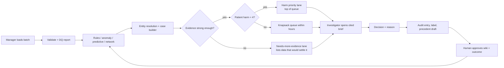
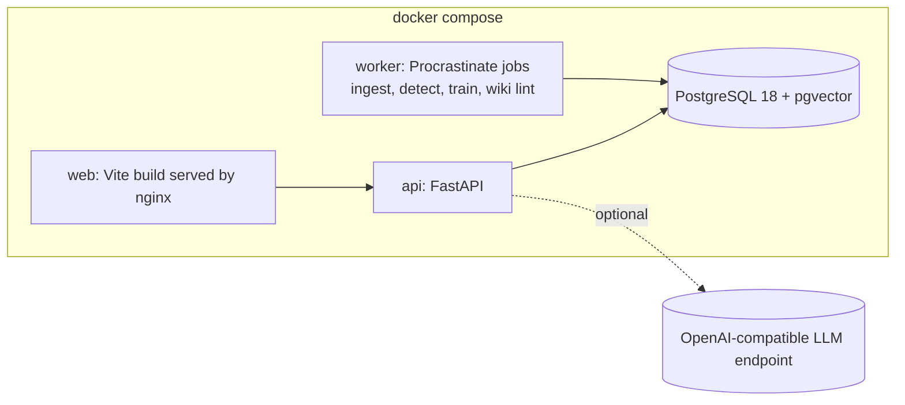
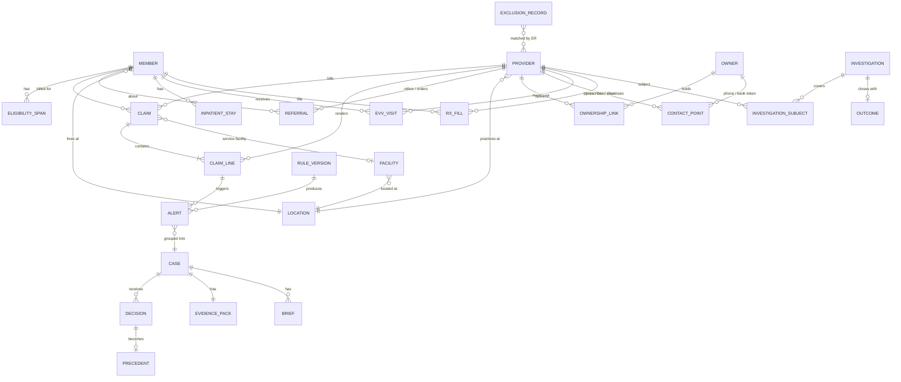
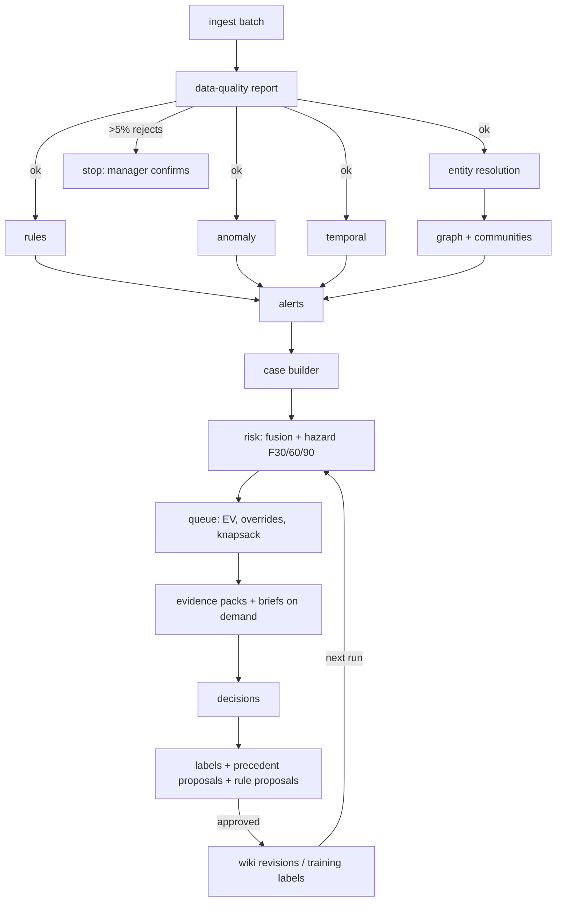
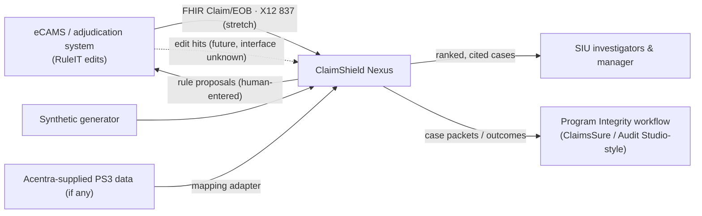
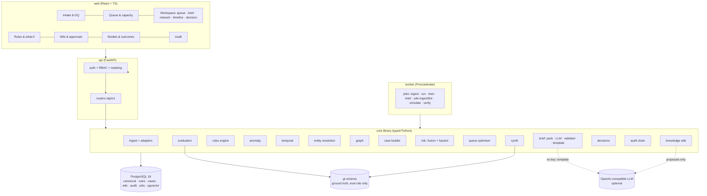
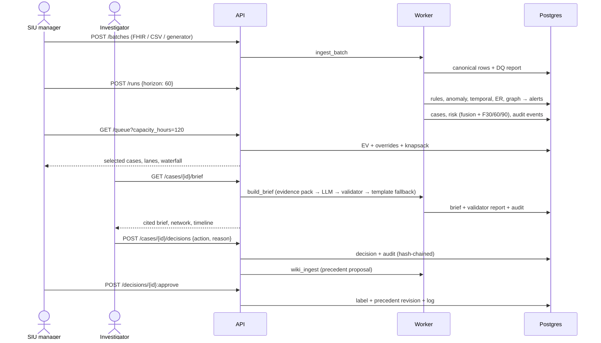
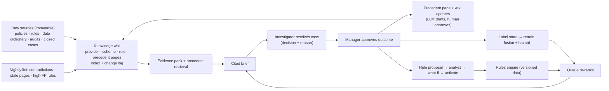

# ClaimShield Nexus: planning pack (DRAFT, 13:04 IST)

> Draft snapshot. Still in progress: index, code-quality section, final reconciliation with Research Lab's brief.

---

# 01 · Problem, users and journey

> Sources: problem statement 3 (PS3); Acentra masterclass notes; IDEA LAB's `IDEATION_AND_IMPROVEMENTS.md` (users, journey, outcomes, merged here and credited); Research Lab's verified brief `01_PS3_research_brief.md` (called **"the brief"** below; its labels [VERIFIED]/[SUPPORTED] are kept where we reuse its facts). Anything marked **[ASSUMPTION]** or **[INFERENCE]** is ours.

## 1. The problem in one sentence

An SIU team gets thousands of unconnected, unexplained claim alerts but can only work a few dozen cases a month. So money is lost on the fraud nobody gets to, honest providers are disrupted by cases that should never have been opened, and fraud that shows up only across claims (rings, shared owners, timing) is never seen at all.

## 2. Why this is hard (what the PS says, in plain words)

- Fraud, waste and abuse (FWA) is often **not visible in one claim**. It appears when claims are linked to provider behaviour, member use, facility locations, referrals, ownership, timing, payment patterns and past investigation outcomes (PS3).
- **Improper payments are not fraud.** CMS estimated FY2025 Medicaid improper payments at 6.12% ($37.39B), but 77.17% of that was insufficient documentation, which CMS says is "generally not indicative of fraud or abuse" (brief §0, [CMS fact sheet](https://www.cms.gov/newsroom/fact-sheets/fiscal-year-2025-improper-payments-fact-sheet) [VERIFIED]). **We never use that figure as a fraud number.** NHCAA's "tens of billions of dollars each year" (3% conservative, up to 10%) is an *estimate* of fraud losses ([NHCAA](https://www.nhcaa.org/tools-insights/about-health-care-fraud/the-challenge-of-health-care-fraud/), checked by us).
- **The scarce resource is investigator time.** CMS contractors must finish screening a lead within 45 calendar days, without contacting the provider, and report suspected beneficiary harm within 2 business days (brief §1.5, [Medicaid PIM ch. 3](https://www.cms.gov/files/document/chapter-3-medicaid-investigations-audits.pdf) [VERIFIED]).
- **False positives cost something real.** Payment suspension is a state decision, needs a "credible allegation of fraud", and has good-cause exceptions such as protecting access when the provider is the sole community provider ([42 CFR 455.23](https://www.ecfr.gov/current/title-42/chapter-IV/subchapter-C/part-455/subpart-A/section-455.23) [VERIFIED in brief]). So our system **recommends only** and never acts on its own.

## 3. Users

| Role | Who they are | Main job in ClaimShield | Top pains today [INFERENCE from brief §1.5 and IDEA LAB] |
|---|---|---|---|
| **SIU investigator** (primary) | Works cases from screening to resolution | Opens ranked cases, reads the brief, checks evidence, decides with a reason | Alert floods with no context; rebuilding the same provider history by hand; no memory of how similar cases ended; scores they cannot explain to a provider or MFCU |
| **SIU manager** | Owns team hours, assignment and the 45-day clock | Loads batches, sets capacity and horizon, approves outcomes, watches outcomes and false positives | Sorting by score does not fit a 20-case week; cannot defend why case A beat case B; no view of dollars recovered vs providers disrupted |
| **Policy / rules analyst** | Turns policy into edits; keeps the knowledge wiki accurate | Adds and versions rules as data linked to policy text; tests a rule on last month's claims; approves wiki changes | Rules go live without knowing how many alerts they create or whom they hit; billing quietly shifts to a neighbouring code after a rule launches |
| **Compliance auditor** (read-only) | Oversight of the process, not the cases | Reads the audit log, verifies the hash chain, exports evidence of due process | Cannot prove who saw member data, who decided, and on what evidence |
| **Admin** | Runs the system | Users, roles, config, LLM key, data retention | Secrets and roles scattered across scripts |

Role split follows the manuals' roles (investigator, manager, clinical/coding reviewer, data analyst; brief §1.5) [SUPPORTED]; merging the coding reviewer into the investigator and adding an analyst/auditor/admin is our design choice [INFERENCE].

## 4. Where ClaimShield sits next to Acentra's products

| Fact | Status |
|---|---|
| eCAMS HCE is a rules-driven claims adjudication platform; its configurable **RuleIT™** engine applies edit and audit rules "including duplicate detection"; it sends to manual review only predefined exceptions such as "potential duplicates, or unusual billing patterns"; it supports HL7, FHIR, X12 and NCPDP ([eCAMS HCE](https://acentra.com/technologies/ecams-hce)) | **Public, checked by us** |
| Acentra's solutions page lists a "Program Integrity Module – Detects fraud, waste, and abuse" among MES modules, says Acentra "provides advanced program integrity ... solutions, enhanced by machine learning", mentions "800 pre-built edits and audits", and describes **Navigator** as giving "instant, source-backed answers" from memos, policies and procedures ([solutions](https://acentra.com/solutions/)) | **Public, checked by us** |
| **ClaimsSure®** (fraud detection) and **Audit Studio®** (audit optimisation) are named in [Acentra's Utah blog](https://acentra.com/blog/beyond-certification-how-utah-and-acentra-health-are-redefining-trust-and-accountability-in-medicaid-modernization); Medicaid.gov's vendor pledge page describes them as "Pre- and post-payment analytics, audit workflow management, and tools supporting fraud, waste, and abuse detection and audit readiness", licensed to states at no cost through 2028 ([pledges](https://www.medicaid.gov/resources-for-states/working-families-tax-cut-legislation/community-engagement/pledges-from-medicaid-tech-companies)) | **Public, checked by us and by the brief** |
| Acentra acquired FEI Systems (announced 5 Aug 2026), adding LTSS, HCBS and behavioral-health platforms; no program-integrity link is stated | Public (brief §2 [VERIFIED]) |
| How ClaimsSure, the PI module or Navigator work inside; whether Navigator uses an LLM; whether RuleIT can export rule hits to another system | **Unknown. Every integration point below is an [ASSUMPTION]** |

**Pitch:** *ClaimShield Nexus sits downstream of eCAMS and feeds Program Integrity.* It takes adjudicated claims (FHIR or X12) and, if available, RuleIT-style edit hits, then adds what single-claim edits cannot: entity resolution, network cases, 30/60/90-day risk, a capacity-fitted queue, cited briefs and a precedent memory. It does **not** replace RuleIT, ClaimsSure or Audit Studio; a confirmed pattern goes back as a **rule proposal** a human analyst can enter in their rules engine.

## 5. End-to-end journey

Adapted from IDEA LAB's journey table, with the uncertain path and the loop made explicit.

| # | Who | User enters | System does | User gets back |
|---|---|---|---|---|
| 1 | Manager | A claims batch: FHIR Claim/ExplanationOfBenefit bundle, our canonical CSV, or a generated synthetic batch (X12 837 is stretch) | Validates against the canonical schema; runs data-quality checks; logs the load | **Data-quality report**: rows loaded, rejected and why; field completeness; late claims; date anomalies |
| 2 | Manager | Team hours for the period (e.g. 120 h), horizon (30/60/90 days), harm weight λ | Runs four layers (rules, peer anomaly, predictive, network), resolves entities, groups alerts into cases, scores 30/60/90 risk | Funnel: **"N alerts → M cases → K fit in 120 h"** |
| 3 | Investigator | Opens *My cases* or the queue | Picks the case set with the highest expected value inside the hours (knapsack); patient-harm cases jump the queue | Ranked queue showing risk, dollars, member impact, severity, evidence strength and hours per case |
| 4 | Investigator | Opens a case | Builds an evidence pack; writes a brief where every sentence cites a claim row, rule, statistic or precedent; validator checks it, template fallback if not | Brief: evidence, timeline, network, confidence, limitations, **recommended human-review action** |
| 5 | Investigator | Clicks footnotes; may unmask member name/DOB (only if assigned; logged) | Opens claim rows, rule + policy text, or precedent page | The facts behind each sentence |
| 6 | Investigator | Decides **escalate / monitor / dismiss / needs more evidence** with a required reason | Appends a hash-chained audit entry; stores the decision as a label; drafts a precedent page and wiki updates for approval | Confirmation + audit receipt |
| 7 | Manager / analyst | Approves the outcome and the wiki change | Precedent becomes citable; labels feed the next model run; repeated patterns become rule proposals | Next run re-ranks; next similar brief cites the precedent |
| U | — | — | **Uncertain path:** evidence strength below threshold, layers disagree, data missing, or model out of distribution → **"Needs more evidence" lane**, never auto-labelled | A list of the exact data that would settle it (e.g. "EVV records for 14 visits", "destination claim for 6 transports", "ownership disclosure for NPI-SYN-0412") and the cheapest next step |



## 6. A day at Acentra with ClaimShield [INFERENCE]

| Time | What happens |
|---|---|
| Overnight | Job ingests yesterday's adjudicated claims from the eCAMS export (FHIR/X12 adapter) and any edit hits; reruns detectors; re-scores the queue; lints the wiki |
| 09:00 | Manager opens the queue page: 3 new harm-priority cases, 14 cases fit this week's 120 h; drags capacity to 100 h after a sick day and sees which 2 cases drop out and why |
| 09:30 | Investigator works a home-care case: brief cites 22 visits without EVV records and a precedent from last month; requests records (the system drew a reproducible sample); marks "monitor 30 days" |
| 14:00 | Analyst sees a rule proposal drafted from three confirmed ambulance cases; runs "test on last month's claims" (412 hits, 9 providers, 2 flagged as sole community providers); edits and enables it; the displacement watch starts |
| Monthly | Manager reviews outcomes: dollars identified vs recovered, false-positive rate in the top K, flag rates by provider type and region, and the loop chart |

## 7. Outcomes we will report (from IDEA LAB, all on synthetic data and labelled so)

Alert-to-case compression; precision and false positives in the top K; recall per planted scheme including unseen variants and one held-out scheme type; rules-only vs ML-only vs combined; expected dollars per investigator-hour at the chosen capacity; calibration of 30/60/90 risk on a rolling time split; top-K hit rate as decided cases accumulate; citation coverage of briefs. Published healthcare-fraud results range from F1 0.15 to 0.948 with "few to no works which establish benchmarks" ([Curtis et al. 2025](https://link.springer.com/article/10.1186/s40537-025-01295-3), brief [VERIFIED]), so honest evaluation is itself a differentiator.

---

# 02 · Idea, features and what we improved

> Feature ideas merge our own brainstorm with IDEA LAB's `IDEATION_AND_IMPROVEMENTS.md` (12 extras, typical-vs-ours table, MVP in/out; credited inline as **[IDEA LAB]**) and Research Lab's brief (**[brief]**). Acentra product statements are limited to what is public (see 01 §4).

## 1. The core idea

**A case is a network, not a claim, and every closed case makes the next one faster.**

1. **Four detection layers**, the same four model types CMS names for its Fraud Prevention System: "rules-based, anomaly, predictive, and network" ([FPS 2nd-year report](https://www.cms.gov/About-CMS/Components/CPI/Widgets/Fraud_Prevention_System_2ndYear.pdf), brief [VERIFIED]).
2. **Alerts collapse into cases** around resolved entities (provider, owner, address, referral chain). Headline metric: **"N alerts → M cases"**.
3. **A capacity-aware queue** picks the set of cases with the highest expected value that fits the SIU's hours, with patient harm as a hard override.
4. **A cited brief** written only from computed evidence; the LLM never labels anyone.
5. **A precedent loop**: decisions become labels, precedent pages and rule proposals, approved by humans.

## 2. The masterclass loop as the spine

Masterclass: *"a connected decision system ... same decision logic, protect continuity, move faster, scale expertise"*; loop: capture expertise → resolve a case → approve the outcome → reuse precedent → use evidence → AI reasoning that should remember; raw sources → AI-maintained knowledge wiki → grounded outputs. This matches Karpathy's "LLM Wiki" pattern: immutable raw sources, an LLM-maintained linked markdown wiki with an `index.md` and an append-only `log.md`, a schema file, and ingest/query/lint operations ([gist](https://gist.github.com/karpathy/442a6bf555914893e9891c11519de94f), read by us).

| Loop step | Concrete feature | Where it lives |
|---|---|---|
| Raw sources (laws, policies, business rules, data definitions, audits, prior decisions) | Immutable `source_document` store (SHA-256 per file): our policy excerpts, rule tables, data dictionary, closed-case JSON | 05 §2, 06 `wiki` |
| Capture expertise | Rules as versioned **data** linked to policy text; investigator reasons are required fields; analyst edits | 06 `rules`, 07 rules page |
| Resolve a case | Case builder + brief + decision bar | 06 `cases`, `brief`, `decisions` |
| Approve the outcome | Manager approval gate; nothing becomes a label or precedent until approved | 08 §6 |
| Reuse precedent | Precedent pages retrieved by similarity (pgvector) and cited in new briefs | 04 §9, 06 `wiki` |
| Use evidence | Evidence pack: claim rows, rule hits, peer stats, SHAP reasons, graph facts, timeline | 06 `brief` |
| AI reasoning that remembers | LLM drafts wiki updates (provider, scheme, rule, precedent pages); lint flags contradictions and stale pages; humans approve | 06 `wiki`, 07 wiki page |
| Grounded outputs (reports, charts, plans, decisions) | Briefs, referral packet, outcomes and loop charts, rule proposals | 07 |
| "Same decision logic / protect continuity" | Same rule versions + precedent apply to every investigator; knowledge survives staff turnover | wiki + audit |

**The loop has to be shown working, not just drawn:** in the demo, the investigator decides 5 cases, the model and precedent update, the queue re-ranks, and the next brief cites the new precedent. The outcomes page plots top-K hit rate against number of decided cases (see 09 §8).

## 3. Feature list

### 3.1 MVP (must work end to end)

| # | Feature | PS line | Why MVP |
|---|---|---|---|
| M1 | Synthetic generator: 8 service lines, 12 planted schemes + 3 rings, hard negatives, labelled ground truth kept outside features | R1 | No public labelled claim-level dataset with networks exists (brief §9) |
| M2 | Adapters: generator, canonical CSV, **FHIR R4 Claim/ExplanationOfBenefit** | R1 | eCAMS lists FHIR support; FHIR is JSON so a parser is cheap [INFERENCE] |
| M3 | Data-quality report on every load | Guidelines (show data fields) | Bad data must stop the pipeline, not create alerts |
| M4 | Rules engine: rules are versioned data entries linked to policy text, ~15 rules across duplicate, PTP pair, unit cap, after-death, >24 h/day, inpatient overlap, EVV missing, excluded party | R2, R3 | Deterministic and explainable; mirrors RuleIT's model of configurable edits |
| M5 | Peer anomaly: robust z and OIG's 75th percentile + 1.5×IQR fence within specialty × region; ECOD/Isolation Forest as a second opinion | R2, R3 | Upcoding and excess utilisation are invisible to rules |
| M6 | Temporal checks: overlapping timed services, services during inpatient stays, monthly spikes | R2 | Impossible timing is in the PS |
| M7 | Graph: shared-address/owner/phone/bank links, referral edges, Leiden communities, centrality | R3, R4 | Rings pass every rule |
| M8 | Entity resolution (deterministic + fuzzy) for providers, owners and exclusion matching | R4 | LEIE has an NPI on only 8,881 of 84,001 records (brief §4 [VERIFIED]) |
| M9 | Case builder: merge alerts by shared entity → **N alerts → M cases** | Desired outcome | The PS's core outcome |
| M10 | Capacity-aware queue (knapsack) + harm override + needs-more-evidence lane | R6 | The PS lists capacity as a ranking factor |
| M11 | Cited brief with validator and template fallback | R7 | Explainability without hallucination |
| M12 | Decision bar → hash-chained audit → label → precedent draft | Masterclass loop | Without it there is no loop |
| M13 | Auth, server-side RBAC, member masking with logged unmask | Guidelines | Responsible handling even on synthetic data |
| M14 | Evaluation report: rules vs ML vs combined; unseen variants; top-K false positives | Judges | Honest numbers |
| M15 | 30/60/90-day risk: one discrete-time hazard model, calibrated, rolling-origin backtest | R5 | Required; done right it is a differentiator |
| M16 | Knowledge wiki: provider, scheme, rule and precedent pages, change log, approvals | Masterclass | The spine |

Build order is in 09 §7: M1→M4→M7/M8→M9→M10→M11→M12 first (vertical slice), then M5/M6, M15, M16, M14.

### 3.2 Stretch (only after the MVP loop runs)

| # | Feature | Why stretch |
|---|---|---|
| S1 | X12 837P/837I adapter for a documented subset of segments | Valuable for eCAMS fit but parsing X12 well takes time; FHIR proves the adapter pattern |
| S2 | **What-if simulation** of a draft rule on last month's claims (alerts, providers hit, dollars, hard-negative hits) | Cheap once rules are data; big analyst value |
| S3 | **Scheme displacement watch** [IDEA LAB] | Needs rule history to show |
| S4 | **Statistically valid random sample + overpayment estimate with CI** [IDEA LAB] | Small but must be statistically correct |
| S5 | Rule suggestions drafted from confirmed cases | Needs several decided cases |
| S6 | "What would clear this case" counterfactual evidence | Builds on the needs-more-evidence lane |
| S7 | Referral packet export (PDF/ZIP) [IDEA LAB] | Formatting work |
| S8 | "Why A ranks above B" side-by-side [IDEA LAB] | Built from the same waterfall data |
| S9 | Sigma.js whole-ring overview | Cytoscape 2-hop view covers the MVP |

### 3.3 Future (described, not built)

| Feature | Why later |
|---|---|
| Prepayment mode (score a claim before payment, hold for review) | Needs integration with an adjudication system and latency guarantees; postpay is the safe start |
| Live RuleIT hit ingestion | Interface not public [ASSUMPTION] |
| EVV and NCPDP pharmacy feeds from real systems | Real data access |
| Multi-tenant, SSO (SAML/OIDC), FedRAMP deployment | Production concerns |
| Member-verification outreach (§455.20) | Process change outside the SIU tool |

## 4. Beyond the PS: extra features chosen

Each was selected because it fixes a real SIU problem, is buildable on top of the MVP data model, and can be measured.

| # | Feature | What it improves | Why a payer cares | Measure | Tier |
|---|---|---|---|---|---|
| X1 | **Rules as versioned data linked to policy text** (rule kind + parameters + policy citation + effective dates + version history), in the spirit of RuleIT [IDEA LAB, Research Lab] | Analysts add rules without code; every alert cites rule version + policy | Same decision logic for every investigator; auditable | Every alert has `rule_id@version` + policy link | MVP |
| X2 | **What-if rule simulation** ("test on last month's claims") | Know alert volume, providers hit, dollars and hard-negative hits before enabling | Avoid floods and provider abrasion | Alerts/week forecast vs actual after launch | Stretch |
| X3 | **Entity resolution** (same owner under different names, addresses, phones, bank tokens) [IDEA LAB] | Rings cannot hide behind new identifiers; exclusion matching works without NPIs | Straw owners appear in real schemes (brief §3 row 8) | Pairwise precision/recall on planted aliases | MVP |
| X4 | **Alert-to-case consolidation + case merge/dedupe** [IDEA LAB] | One ring = one case; two investigators never work the same provider unknowingly | Saves hours | Compression ratio; duplicate-case rate | MVP |
| X5 | **Capacity-aware selection, not sorting** [IDEA LAB] | Best set for the hours, not top scores | The PS names capacity | Expected $ per investigator-hour vs sort-by-score | MVP |
| X6 | **Graduated action ladder**, recommend only [IDEA LAB]: monitor → provider education letter → records request (with sample) → prepayment review → refer for MFCU consideration → payment suspension (human/state decision only, with a 455.23 good-cause badge) | Proportionate response; less provider disruption | Matches real resolution options (42 CFR 455.16, 455.21, 455.23 per brief) | Share of cases resolved below referral; appeals avoided | MVP (ladder), stretch (letters) |
| X7 | **Statistically valid random sampling + overpayment extrapolation with confidence interval** (reproducible seed; the sample becomes the records request) [IDEA LAB], in the spirit of OIG's RAT-STATS tool ([OIG RAT-STATS](https://oig.hhs.gov/compliance/rat-stats/)) | Investigators review 30–100 claims, not 4,000 | Standard practice for overpayment estimates | CI coverage on synthetic truth | Stretch |
| X8 | **Post-rule displacement monitoring** [IDEA LAB]: after a rule goes live, compare code mix and provider mix before vs after for flagged providers and ring members; alert when billing shifts to neighbouring codes or other ring members | Treats fraud as adaptive | Rules are gamed (brief §3 row 17: a 2026 hospice owner gamed a known metric) | Planted displacement caught within N weeks | Stretch |
| X9 | **Rule suggestions from confirmed cases** (drafted, human-approved) | Expertise becomes reusable rules | Feeds RuleIT-style engines [ASSUMPTION about interface] | Proposals accepted / rejected | Stretch |
| X10 | **"What would clear this case"** counterfactual evidence list | Investigators know the cheapest next request | Faster closure, fairer to honest providers | Median days in needs-more-evidence lane | Stretch |
| X11 | **Provider-disruption guardrail + fairness check** (peer groups by specialty × region × case-mix; flag rates by provider type and region; sole-community-provider badge) [IDEA LAB] | Rural and high-acuity practices are not flagged for serving sicker members | Access to care; 455.23 good cause | Flag-rate ratio across groups; hard-negative FP rate | MVP (check), stretch (dashboard) |
| X12 | **Grounding check on every brief** (cited IDs exist, numbers appear in evidence pack) [IDEA LAB, brief] | No invented facts | Briefs may go into referrals | Citation coverage = 100% on shipped briefs | MVP |
| X13 | **Drift and alert-volume monitoring** | Detect generator/real-data shift and rule floods | Models decay (concept drift) | PSI per feature; alerts/week control chart | Stretch |
| X14 | **Recovery and outcome tracking** | Dollars identified vs recovered vs written off | The only number finance trusts | Recovery rate by scheme | MVP (fields), stretch (charts) |
| X15 | **SLA and case ageing** (45-day screening clock; 2-business-day harm notice) | Nothing silently breaches a deadline | CMS contractor timelines (brief §1.5) | Cases past SLA | MVP |
| X16 | **"Why A ranks above B"** factor-by-factor [IDEA LAB] | Managers can defend prioritisation | Due process, auditability | — | Stretch |
| X17 | **Referral packet export** (brief, evidence table, sample, timeline, audit trail) [IDEA LAB] | One click to escalate | MCOs must refer promptly (brief §1.4) | Time to packet | Stretch |
| X18 | **Prepay vs postpay mode switch** | Same detectors, different thresholds and actions | Prevent vs recover | — | Future |

## 5. What we improved over the typical approach

Merged from IDEA LAB's table and ours.

| Typical approach | ClaimShield Nexus | How we measure it |
|---|---|---|
| Score each claim, show a list of alerts | Merge alerts into cases around resolved entities and networks | Compression ratio N→M; recall on rings where every claim passes every rule |
| Sort by risk score | Knapsack selection within team hours, harm override, needs-more-evidence lane | Expected $ per investigator-hour vs sort-by-score at the same capacity |
| Black-box score | Calibrated probability + SHAP reasons + rule citations + a cited brief | Brier score, reliability plot; citation coverage 100% |
| Static rules in code | Versioned rules as data, linked to policy, tested before launch, watched for displacement | What-if forecast error; displacement detected |
| No memory of past decisions | Decisions become labels, precedent pages and rule proposals, approved by humans | Top-K hit rate rising with decided cases |
| LLM chatbot over the data | LLM writes only from a computed evidence pack, validated; template fallback | Unsupported sentences dropped per brief (target 0 shipped) |
| Accuracy on the same synthetic data the model was trained on | Rolling time split, unseen scheme variants, one whole scheme type held out, rules vs ML vs combined | Per-scheme recall on held-out variants |
| Dollars caught only | Dollars plus false positives in top K, member impact and flag-rate fairness | FP rate in top K beside $ caught |
| Replaces the payer's system | Sits downstream of eCAMS-style systems (FHIR/X12) and feeds program integrity | Adapter contract tests |
| GNN for show | Graph features + classic ML, which beat a GNN on recall/F1 and trained ~250–300× faster in a 2023 study ([Yoo, Shin & Kyeong 2023](https://doi.org/10.1109/ACCESS.2023.3305962), brief [VERIFIED]) | Training time; explainable graph facts in briefs |

## 6. Scope guardrails [IDEA LAB]

Out: GNNs, Neo4j, Kafka, real patient or provider data, AMA CPT files, any automatic action against a provider. In: 12 planted schemes + 3 rings across service lines, one full loop shown end to end. Stretch only after the MVP loop runs.

---

# 03 · Tech stack

Versions were checked on **8 Oct 2026** against PyPI, npm, Docker Hub, endoflife.date and project sites. We pin the **major.minor** in docs and lock exact versions in `uv.lock` and `package-lock.json`. Rule for every choice: *boring, typed, runnable on a laptop with `docker compose up`, and easy to explain line by line.*

## 1. Runtime and infrastructure

| Layer | Choice (pin) | Why this | Why not X |
|---|---|---|---|
| Language | **Python 3.14** | In full bugfix support (3.13 moved to security-only on 1 Oct 2026; 3.12 is security-only). Every heavy dependency ships 3.14 wheels; `shap 0.52` ships wheels only for cp312 and cp314, which rules out 3.13 | 3.12: works too (our fallback), but older; 3.13: no SHAP wheel |
| Package/env manager | **uv 0.12** | One fast tool for venv, lockfile and scripts; reproducible `uv sync --frozen` in CI | pip + pip-tools: two tools, slower; Poetry: slower resolver |
| Database | **PostgreSQL 18** + **pgvector 0.8.7** (image `pgvector/pgvector:0.8.7-pg18`) | One store for relational data, the audit chain, job queue and precedent vectors; JSONB for evidence packs; mature | Neo4j: second database, licence and ops cost, graph sizes here fit in memory; SQLite: no pgvector, weak concurrency; DuckDB (the brief's suggestion): great for analytics but not a multi-user OLTP store with row-level audit |
| Background jobs | **Procrastinate 3.10** (Postgres-based task queue) | Uses the Postgres we already run (LISTEN/NOTIFY); retries, locks, scheduling; no Redis | Celery/RQ/arq/Dramatiq: need Redis or RabbitMQ; Kafka: out of scope by decision |
| Containers | **Docker Compose** (services: `db`, `api`, `worker`, `web`) | `make demo` / `docker compose up` gives a judge the whole system | Kubernetes: unnecessary |
| CI | **GitHub Actions** | Free for public repos; matrix for backend/frontend/e2e | — (see 10 §7: the workflow file is added through the website because the token lacks the `workflow` scope) |

## 2. Backend

| Concern | Choice (pin) | Why this | Why not X |
|---|---|---|---|
| Web framework | **FastAPI 0.142** + **Uvicorn 0.54** | Typed endpoints, OpenAPI generated for free (drives frontend types and contract tests), dependency injection for auth | Django: heavier ORM/admin we don't need; Flask: no typed request models |
| Validation | **Pydantic 2.13**, **pydantic-settings 2.15** | One schema language for API, config and evidence packs | dataclasses: no validation |
| ORM / migrations | **SQLAlchemy 2.1** (typed `Mapped[]`), **Alembic 1.20** | Explicit SQL when needed, typed models, reviewed migrations | SQLModel: thinner but couples API and DB models; raw SQL: no migrations |
| DB driver | **psycopg 3.3**, **pgvector-python 0.5** | Native Postgres types, COPY for bulk loads | asyncpg: faster, but psycopg also serves Procrastinate and Alembic |
| Dataframes | **pandas 3.0** | Feature pipelines interoperate with scikit-learn, SHAP and pandera without conversion | Polars 2.0: faster, but every model library expects pandas/NumPy; mixing both doubles the mental load. Revisit if the generator is too slow |
| Data contracts | **pandera 0.34** | Column types, ranges and cross-field checks for each canonical table (fails a load loudly) | Great Expectations: heavier |
| Graph | **NetworkX 3.7** | Pure Python, BSD-3; 3.7 includes **`leiden_communities`** and `louvain_communities` natively (checked in the 3.7 docs), plus centrality and components | igraph + leidenalg (the brief's suggestion): faster, but GPL-licensed native packages add licence questions and build complexity; Neo4j/GDS: separate service |
| Classic ML | **scikit-learn 1.9** | Robust scaling, Isolation Forest, `CalibratedClassifierCV`, `TimeSeriesSplit`, logistic baseline | — |
| Gradient boosting | **LightGBM 4.7** | Fast on CPU, handles class imbalance and categorical features; TreeSHAP support | XGBoost: equally good; one GBM is enough. CatBoost: slower to train |
| Outlier detection | **PyOD 3.6** (ECOD) | ECOD is parameter-free and explains per-feature tail probabilities | Autoencoders: need tuning and are hard to explain |
| Explanations | **SHAP 0.52** (TreeExplainer) | Exact, fast attributions for tree models | LIME: unstable explanations |
| Fuzzy matching | **RapidFuzz 3.14** | Fast string similarity (MIT) for entity resolution | Splink (MIT, Fellegi–Sunter): strong, but heavier; stretch upgrade |
| Synthetic names/addresses | **Faker 40** | Seeded, reproducible fake identities | Real NPPES/LEIE names: banned (defamation risk) |
| Optimisation | **Own 0/1 knapsack DP** (≈40 lines, property-tested) | Queue sizes (≤ 500 cases × ≤ 400 half-hour slots) solve exactly in milliseconds; no dependency | OR-Tools: a large native dependency for one small problem |
| LLM | **Provider-agnostic `LLMClient` protocol**, one adapter for any OpenAI-compatible HTTP endpoint (via **httpx 0.28**), plus **deterministic template renderer** used when no key is set or validation fails | Fails safe; judges can run it offline; no vendor lock-in | LiteLLM: large dependency surface for a single call type; vendor SDKs: lock-in |
| Text vectors for precedent | Offline default: TF-IDF + TruncatedSVD (256-d) from scikit-learn, stored in pgvector; optional provider embeddings when a key is set | Works with no key and no GPU; same retrieval code path | sentence-transformers: pulls in PyTorch (GBs) |
| Auth | **PyJWT 2.15**, **argon2-cffi 25.1** | Small, audited libraries; Argon2id password hashing | Hand-rolled crypto: never |
| Logging | **structlog 26** | JSON logs with request and case IDs | print / stdlib only |

## 3. Frontend

| Concern | Choice (pin) | Why this | Why not X |
|---|---|---|---|
| Runtime | **Node 24 LTS** | Active LTS (Node 26 becomes LTS on 28 Oct 2026; upgrade after the event) | Node 26 today: not LTS yet |
| Framework | **React 19** + **TypeScript 6.0** | Team familiarity; strict typing | TypeScript 7.0 (native compiler) is out, but `typescript-eslint 8.71` supports TS < 6.1 only, so 6.0 keeps lint working |
| Build | **Vite 8** + `@vitejs/plugin-react 6` | Fast dev server, simple config | Next.js: SSR we do not need behind a login |
| Routing | **TanStack Router 1** | Type-safe routes and search params (`caseId`, horizon, capacity live in the URL, so a link reproduces a view) | React Router 8: fine, but untyped search params |
| Server state | **TanStack Query 5** | Caching, invalidation after decisions, retries | Redux: we have little client-only state |
| Forms | **react-hook-form 7** + **zod 4** | Typed validation for decision reasons and rule edits | — |
| API types | **openapi-typescript 7** | Generates TS types from FastAPI's OpenAPI; CI fails if they drift | Hand-written types: drift |
| Network view | **Cytoscape.js 3.34** + **cytoscape-fcose 2.2** | 2-hop neighbourhood with a force layout that respects compound nodes (e.g. owner groups); MIT | D3 force: more code; full-graph views: hairball |
| Ring overview | **Sigma.js 3** + **graphology 0.26** (stretch) | WebGL for whole-ring overviews only | — |
| Charts | **Recharts 3** | Declarative React charts for calibration, loop and outcomes charts | ECharts 6: powerful, larger bundle |
| Styling | **Tailwind CSS 4** | Consistent spacing/colour tokens; small CSS | Component kits with heavy theming |

## 4. Quality and test tooling

| Tool (pin) | Use |
|---|---|
| **ruff 0.16** | Lint + format; includes `S` (bandit-style security) rules, so we skip a separate bandit run |
| **mypy 2.4** (strict) | Type checks for `src/` |
| **pytest 9.1**, **pytest-cov 7.1**, **coverage 7.16** | Unit/integration tests and coverage gate |
| **hypothesis 6.168** | Property tests (knapsack optimality on small inputs, hash chain, rule invariants) |
| **schemathesis 4.29** | Fuzz the API from its OpenAPI schema (auth, 4xx not 5xx) |
| **pip-audit 2.10** | Dependency vulnerability scan |
| **pre-commit 4.6** | ruff, mypy, prettier/eslint, end-of-file, no large files, no secrets |
| **ESLint 10** + **typescript-eslint 8.71** | Frontend lint |
| **Vitest 5** + Testing Library | Component and hook tests |
| **MSW 3** | Mock the API in component tests |
| **Playwright 1.64** + **@axe-core/playwright 4.13** | End-to-end demo flow and accessibility checks |

## 5. What runs where



Minimum laptop: 4 cores, 8 GB RAM. The `small` data profile (6k members, ~150k lines) runs the full pipeline in minutes [ASSUMPTION, to measure in phase 1]; the `full` profile (20k members, ~0.6–1M lines over 24 months) is for the evaluation run.

## 6. Licences of what we depend on

All core dependencies are permissive: FastAPI, Pydantic, SQLAlchemy, LightGBM, SHAP, RapidFuzz, Cytoscape.js, cytoscape-fcose, Sigma.js, graphology, Recharts, Procrastinate (MIT); PyOD (BSD-2); NetworkX, scikit-learn (BSD-3); pgvector (PostgreSQL licence); Synthea (Apache-2.0, only if used). Licence keys for LightGBM, SHAP, PyOD, NetworkX, pgvector, Cytoscape, fcose, Sigma, graphology, Splink, Procrastinate, RapidFuzz and Synthea were checked on GitHub on 8 Oct 2026; the rest should be confirmed by `pip-licenses`/`license-checker` in CI (10 §5).

---

# 04 · Models, methods and research

**Primary source:** Research Lab's verified brief (`/workspace/acentra-ps3/01_PS3_research_brief.md`, called "the brief"). Citations marked **[brief]** come from it with its verification label. Citations marked **[live]** are not in the brief but were checked by us on 8 Oct 2026 against Crossref, arXiv or the publisher (title, authors, year, venue, link). Nothing is cited from memory. Status: **reconciled with the brief on 8 Oct 2026**; any conflict was resolved in the brief's favour.

## 1. Design principles from the literature

1. **Four layers, not one model.** CMS's Fraud Prevention System uses "rules-based, anomaly, predictive, and network" models [brief, VERIFIED]. We mirror that.
2. **No published model is a safe default.** Reported F1 ranges from 0.15 to 0.948 and there are "few to no works which establish benchmarks" (Curtis et al. 2025) [brief, VERIFIED]. So we invest in honest evaluation (§12).
3. **Graph features + classic ML, not GNNs.** Centrality features with ML beat the best GNN by about +24 points recall and +14 F1 and trained roughly 250–300× faster (Yoo et al. 2023) [brief, VERIFIED; caveat: Kaggle data of unknown provenance].
4. **Shared address and shared owner are the strongest network signals.** Shared-location risk propagation predicted exclusion with F1 0.919 / AUC 0.960, driven mostly by collocation features (Branting et al. 2016) [brief, SUPPORTED: abstract]; straw owners across dozens of DME firms in Operation Gold Rush [brief, VERIFIED].
5. **The LLM never decides.** It writes from computed evidence; a validator checks it (§10).

## 2. Method map

| # | Method | Catches (scheme IDs from 05 §4) | Output the brief can cite | MVP? |
|---|---|---|---|---|
| 1 | Rules engine (rule kinds × versioned parameters) | S01, S03, S04, S05, S06, S07, S08, S09, S11, S12 | `rule_hit(rule_id@version, claim_line_ids, values)` | **MVP** |
| 2 | Peer-comparison anomaly (robust z, IQR fence, ECOD, Isolation Forest) | S02, S10, S12, camouflaged variants | Metric, provider value, peer median, percentile, peer group | **MVP** (robust z + IQR + ECOD); Isolation Forest as comparison |
| 3 | Temporal checks (overlaps, inpatient overlap, spikes, ramp/CUSUM) | S06, S07, S08, S09, bust-outs | Timeline events with timestamps | **MVP** (overlaps, spikes); CUSUM stretch |
| 4 | Graph analytics (shared-attribute edges, referral edges, Leiden, centrality, path to known-bad) | G1, G2, G3 | Community ID, shared attributes, path, centrality percentile | **MVP** |
| 5 | Entity resolution | G3, S11, aliases in G1 | Match pair, fields compared, score | **MVP** (deterministic + RapidFuzz); Splink stretch |
| 6 | Fusion: calibrated case probability | all | `p_confirm`, evidence strength | **MVP** |
| 7 | 30/60/90 discrete-time hazard model | escalation / repeat | `F(30)`, `F(60)`, `F(90)` + SHAP reasons | **MVP** (phase 2) |
| 8 | Capacity-aware queue (knapsack + overrides) | — | Value waterfall per case | **MVP** |
| 9 | Precedent retrieval | — | `precedent_id`, similarity, matching facts | **MVP** (phase 2) |
| 10 | Evidence-grounded brief + validator | — | Every sentence cites an ID | **MVP** |
| 11 | Wiki maintenance + lint | — | Change proposals, lint findings | **MVP** (phase 3) |
| 12 | Sampling + overpayment CI; displacement watch; drift | — | Sample IDs, CI; before/after mix; PSI | Stretch |

## 3. Rules (MVP)

- **What:** each rule is a *rule kind* implemented once in code and tested (e.g. `ptp_pair`, `unit_cap`, `duplicate`, `after_death`, `daily_minutes_cap`, `inpatient_overlap`, `evv_missing`, `excluded_party`, `transport_without_destination`, `doctor_shopping`) plus a *rule entry* stored as versioned data: parameters, severity, service lines, effective dates and a **policy citation**. An analyst adds a new entry the way RuleIT lets staff configure edits ([eCAMS HCE](https://acentra.com/technologies/ecams-hce), checked by us). New kinds need code; new rules do not.
- **Public models we copy the *format* of, not the content:**
  - NCCI PTP edits: Column 1 / Column 2 codes, effective and deletion dates, **modifier indicator 0 = not allowed, 1 = allowed, 9 = not applicable** ([CMS PTP page](https://www.cms.gov/medicare/coding-billing/national-correct-coding-initiative-ncci-edits/medicare-ncci-procedure-procedure-ptp-edits) and the [MLN "How to Use NCCI Tools" booklet](https://www.cms.gov/outreach-and-education/medicare-learning-network-mln/mlnproducts/downloads/how-to-use-ncci-tools.pdf), both read by us; [brief, VERIFIED]).
  - MUEs: maximum units per code per line/day, with MUE Adjudication Indicators 1 (claim line), 2 (absolute date-of-service policy), 3 (date of service) (same MLN booklet, read by us). Medicaid applies MUEs per claim line [brief, VERIFIED]. Example value we may reuse because it is a HCPCS Level II row: A0425 ground ambulance mileage MUE = 250 in the Oct-2026 Medicaid practitioner file [brief, VERIFIED].
  - Duplicate edits (same member, provider, code, modifier, date) per OIG's New Hampshire audit [brief, VERIFIED].
  - >24 h/day and services during inpatient stays per DOJ 2026 examples ("500 or more hours of counseling ... per day") [brief, VERIFIED].
  - EVV's six required elements (service type, individual, date, location, provider, start/end time) [brief, VERIFIED].
  - Exclusion: no federal payment for items furnished, ordered or prescribed by excluded parties; states check LEIE monthly ([HHS-OIG Exclusions](https://oig.hhs.gov/exclusions/), read by us; 42 CFR 455.436 [brief, VERIFIED]).
- **Licence catch:** CPT is AMA-owned; the CMS download sits behind an AMA point-and-click licence that forbids "creating any modified or derivative work of CPT" and transfer to parties not bound by it (CMS licence page, read via search 8 Oct 2026; AMA FAQ [brief, VERIFIED]). We ship **our own** PTP/MUE-format tables using HCPCS Level II codes and synthetic codes only (05 §5).

## 4. Peer-comparison anomaly scoring (MVP)

- **Peer group:** specialty × region × case-mix band (members' average risk tier), minimum 20 peers, else widen region. This is the fairness guard (08 §9).
- **Features (provider-month):** share of top-two E/M levels; units per member; visits per member; paid per member; minutes per day; share of members shared with another provider; bypass-modifier rate; distinct members per day.
- **Scores:**
  - Robust z = (x − median) / (1.4826 × MAD).
  - **OIG fence:** outlier if above the 75th percentile + 1.5 × IQR, as OIG used for home health (six measures) ([OEI-04-11-00240](https://oig.hhs.gov/documents/evaluation/2847/OEI-04-11-00240-Complete%20Report.pdf)) [brief, VERIFIED].
  - **ECOD** on the feature vector: per-dimension empirical tail probabilities, parameter-free and interpretable [live].
  - **Isolation Forest** as a comparison baseline [brief + live].
- **Upcoding caution:** OIG found 1,669 physicians billing the two highest E/M levels in ≥95% of visits but **did not conclude this was inappropriate** [brief, VERIFIED]. So peer anomaly alone never exceeds "monitor" without a second layer (evidence strength, §6).

| Paper | Authors | Year | Venue | Link | Source |
|---|---|---|---|---|---|
| Isolation Forest | F. T. Liu, K. M. Ting, Z.-H. Zhou | 2008 | IEEE ICDM 2008, pp. 413–422 | [doi:10.1109/ICDM.2008.17](https://doi.org/10.1109/ICDM.2008.17) | brief + live |
| ECOD: Unsupervised Outlier Detection Using Empirical Cumulative Distribution Functions | Z. Li, Y. Zhao, X. Hu, N. Botta, C. Ionescu, G. H. Chen | 2022 | IEEE TKDE (accepted, per arXiv comments) | [arXiv:2201.00382](https://arxiv.org/abs/2201.00382) | live |
| PyOD: A Python Toolbox for Scalable Outlier Detection | Y. Zhao, Z. Nasrullah, Z. Li | 2019 | JMLR 20(96):1–7 | [arXiv:1901.01588](https://arxiv.org/abs/1901.01588) | live |
| A survey on the state of healthcare upcoding fraud analysis and detection | R. Bauder, T. M. Khoshgoftaar, N. Seliya | 2017 | Health Services and Outcomes Research Methodology 17:31–55 | [doi:10.1007/s10742-016-0154-8](https://doi.org/10.1007/s10742-016-0154-8) | brief + live |

## 5. Temporal checks (MVP)

- **Impossible timing:** sum of timed minutes per rendering clinician per day > 1,440 (or a configurable plausible ceiling, e.g. 16 h); overlapping ambulance trips for one vehicle/crew; home-care visits overlapping for one aide; any home or behavioural service during the member's inpatient stay.
- **Spikes and ramps:** month-over-month change in paid dollars vs the provider's own history (robust z on log ratio); new supplier with a billing spike (enrol → spike → vanish "bust-out", DOJ 2026 cites data-driven bust-out targeting [brief, VERIFIED]). CUSUM change-points are stretch.

## 6. Graph analytics and entity resolution (MVP)

- **Graph (NetworkX, rebuilt per run, persisted as edge tables in Postgres):** nodes = provider, member, facility/location, owner, phone, bank token; edges = billed-for, referred-to, located-at, owned-by, shares-phone, shares-bank, ordered-by.
- **Signals:** shared address / shared owner (strongest per brief); referral concentration (HHI) and reciprocal referrals; community detection with **Leiden** (well-connected communities; NetworkX 3.7 `leiden_communities`, seeded) and Louvain as a fallback; internal-referral share of a community; degree/eigenvector/PageRank centrality (the features Yoo et al. used); shortest path to a known-bad entity (excluded, previously substantiated).
- **Entity resolution:** block on normalised ZIP + street number, phone, bank token, DOB; compare names and addresses with RapidFuzz (token-set ratio, Jaro–Winkler); combine field agreements with Fellegi–Sunter-style log-likelihood weights; deterministic links (same TIN, same bank token) override. Needed because LEIE has an NPI on only 8,881 of 84,001 records, so exclusion matching must use name + DOB + address [brief, VERIFIED]. Matches below a threshold go to a review list, never auto-merge.

| Paper | Authors | Year | Venue | Link | Source |
|---|---|---|---|---|---|
| Medicare Fraud Detection Using Graph Analysis: A Comparative Study of Machine Learning and Graph Neural Networks | Y. Yoo, J. Shin, S. Kyeong | 2023 | IEEE Access 11:88278–88294 | [doi:10.1109/ACCESS.2023.3305962](https://doi.org/10.1109/ACCESS.2023.3305962) | brief + live |
| Graph analytics for healthcare fraud risk estimation | L. K. Branting, F. Reeder, J. Gold, T. Champney | 2016 | IEEE/ACM ASONAM, pp. 845–851 | [doi:10.1109/ASONAM.2016.7752336](https://doi.org/10.1109/ASONAM.2016.7752336) | brief + live |
| Fast unfolding of communities in large networks (Louvain) | V. D. Blondel, J.-L. Guillaume, R. Lambiotte, E. Lefebvre | 2008 | J. Stat. Mech. P10008 | [doi:10.1088/1742-5468/2008/10/P10008](https://doi.org/10.1088/1742-5468/2008/10/P10008) · [arXiv:0803.0476](https://arxiv.org/abs/0803.0476) | brief + live |
| From Louvain to Leiden: guaranteeing well-connected communities | V. A. Traag, L. Waltman, N. J. van Eck | 2019 | Scientific Reports 9:5233 | [doi:10.1038/s41598-019-41695-z](https://doi.org/10.1038/s41598-019-41695-z) · [arXiv:1810.08473](https://arxiv.org/abs/1810.08473) | brief + live |
| Fraud detection: A systematic literature review of graph-based anomaly detection approaches | T. Pourhabibi, K.-L. Ong, B. H. Kam, Y. L. Boo | 2020 | Decision Support Systems 133:113303 | [doi:10.1016/j.dss.2020.113303](https://doi.org/10.1016/j.dss.2020.113303) | live |
| Graph based anomaly detection and description: a survey | L. Akoglu, H. Tong, D. Koutra | 2015 | Data Mining and Knowledge Discovery 29:626–688 | [doi:10.1007/s10618-014-0365-y](https://doi.org/10.1007/s10618-014-0365-y) | live |
| A Theory for Record Linkage | I. P. Fellegi, A. B. Sunter | 1969 | JASA 64:1183–1210 | [doi:10.1080/01621459.1969.10501049](https://doi.org/10.1080/01621459.1969.10501049) | live |

## 7. Fusion: case probability and evidence strength (MVP)

- **Case features:** max/mean layer scores, number of independent layers that fired, rule determinism (hard rule vs statistical), dollars flagged, data completeness, prior outcomes on the entity.
- **Model:** logistic-regression stacker over layer scores (brief §5.3), calibrated (Platt or isotonic on the validation fold). Before investigation labels exist, a transparent weighted score is used and labelled "uncalibrated".
- **Evidence strength E ∈ [0,1]:** agreement of independent layers (rules, anomaly, temporal, network), determinism of the strongest evidence, and completeness of the data behind it. **E < 0.4 → needs-more-evidence lane** [INFERENCE: threshold tuned on validation].

## 8. 30/60/90-day risk: one discrete-time hazard model (MVP, phase 2)

- **Unit:** provider × 30-day interval with snapshot date *t*.
- **Event in (t, t+30]:** first of a substantiated outcome (dated at case closure), a new high-severity rule hit, or a >X% rise in dollars on flagged codes. "Repeat" = prior substantiated or education outcome; "escalating" = flagged metric trending up (brief §6.1).
- **Model:** one LightGBM classifier for the interval hazard *h_k* = P(event in interval k | none before), features at *t* only. Cumulative risk **F(30) = h1, F(60) = 1 − (1−h1)(1−h2), F(90) = 1 − (1−h1)(1−h2)(1−h3)**, so risks rise monotonically with the horizon and censored providers are handled (brief §6.1, Option B). Logistic hazard model as baseline.
- **Calibration:** isotonic or Platt on the validation origin; reliability diagram + Brier score shown on the model page. Calibration matters because the queue multiplies p × dollars.
- **Explanations:** TreeSHAP per prediction, translated through a feature dictionary ("top-level visit share 71% vs specialty median 18%").
- **Backtest:** rolling-origin splits (05 §7). Report PR-AUC, precision@K and recall@K at investigator capacity, dollar-weighted recall, Brier score.
- **Six leakage traps** (brief §6.2) and our guard for each:

| Trap | Guard |
|---|---|
| Random splits | Rolling-origin time splits only |
| Late claims | Features require `dos ≤ t` **and** `received_date ≤ t` |
| Label dating | Labels dated at case closure, not service dates |
| Process features ("records requested", "suspended") | Banned from the feature list by a test |
| Ring members split across train and test | Group split by community/scheme |
| Generator artefacts (scheme columns, ID ranges, round amounts) | Ground truth stored outside the feature schema; a test fails if any feature derives from it; amounts jittered; IDs random |

| Paper / source | Authors | Year | Venue | Link | Source |
|---|---|---|---|---|---|
| LightGBM: A Highly Efficient Gradient Boosting Decision Tree | G. Ke, Q. Meng, T. Finley, T. Wang, W. Chen, W. Ma, Q. Ye, T.-Y. Liu | 2017 | NeurIPS 30 | [proceedings](https://papers.nips.cc/paper_files/paper/2017/hash/6449f44a102fde848669bdd9eb6b76fa-Abstract.html) | live |
| A Unified Approach to Interpreting Model Predictions (SHAP) | S. Lundberg, S.-I. Lee | 2017 | NIPS 2017 (per arXiv comments) | [arXiv:1705.07874](https://arxiv.org/abs/1705.07874) | brief + live |
| From local explanations to global understanding with explainable AI for trees (TreeSHAP) | S. M. Lundberg, G. Erion, H. Chen, A. DeGrave, J. M. Prutkin, B. Nair, et al. | 2020 | Nature Machine Intelligence 2:56–67 | [doi:10.1038/s42256-019-0138-9](https://doi.org/10.1038/s42256-019-0138-9) | live |
| Predicting good probabilities with supervised learning | A. Niculescu-Mizil, R. Caruana | 2005 | ICML, pp. 625–632 | [doi:10.1145/1102351.1102430](https://doi.org/10.1145/1102351.1102430) | brief + live |
| Transforming classifier scores into accurate multiclass probability estimates (isotonic) | B. Zadrozny, C. Elkan | 2002 | ACM KDD, pp. 694–699 | [doi:10.1145/775047.775151](https://doi.org/10.1145/775047.775151) | live |
| On Calibration of Modern Neural Networks | C. Guo, G. Pleiss, Y. Sun, K. Q. Weinberger | 2017 | ICML 2017 (per arXiv comments) | [arXiv:1706.04599](https://arxiv.org/abs/1706.04599) | live |
| The Precision-Recall Plot Is More Informative than the ROC Plot ... on Imbalanced Datasets | T. Saito, M. Rehmsmeier | 2015 | PLOS ONE | [doi:10.1371/journal.pone.0118432](https://doi.org/10.1371/journal.pone.0118432) | brief |
| Leakage in data mining: formulation, detection, and avoidance | S. Kaufman et al. | 2012 | ACM (see DOI) | [doi:10.1145/2382577.2382579](https://doi.org/10.1145/2382577.2382579) | brief |
| Credit Card Fraud Detection: A Realistic Modeling and a Novel Learning Strategy (alert–feedback loop, delayed labels) | A. Dal Pozzolo, G. Boracchi, O. Caelen, C. Alippi, G. Bontempi | 2018 | IEEE TNNLS 29:3784–3797 | [doi:10.1109/TNNLS.2017.2736643](https://doi.org/10.1109/TNNLS.2017.2736643) | live |
| scikit-learn calibration; TimeSeriesSplit; lifelines; scikit-survival | — | — | docs | [calibration](https://scikit-learn.org/stable/modules/calibration.html) · [TimeSeriesSplit](https://scikit-learn.org/stable/modules/generated/sklearn.model_selection.TimeSeriesSplit.html) | brief |

Dal Pozzolo et al. matter for the loop: investigator feedback is a biased, delayed label stream (we only learn about cases we opened). We log which cases were *shown* vs *decided* so retraining can weight for that [INFERENCE].

## 9. Capacity-aware queue (MVP)

- **Borrowed from CMS:** Medicare PIM ch. 4 §4.13 scores likelihood, patient harm, financial impact and breadth on 1–4 scales; investigations "with the greatest program impact and/or urgency" go first; dollars at risk count **outlier codes only**; $50k exposure guide waived when fraud is suspected; zero tolerance for beneficiary harm with a 2-business-day notice [brief, VERIFIED].
- **Value of case i:** `EV_i = p_i(h) · r_i · D_i(h) + λ · H_i`
  - `p_i(h)` calibrated probability of a substantiated outcome within horizon h (fusion model in phase 1, hazard model F(h) from phase 2);
  - `r_i` expected recovery rate (configurable per scheme type, default 0.5 [ASSUMPTION]);
  - `D_i(h)` dollars on **flagged lines only**, plus projected run-rate over h, shown separately;
  - `H_i` = harm score 1–4 (CMS scale) × members affected; λ is the manager's slider converting harm into dollars.
- **Also shown, not multiplied in:** severity S (1–4), evidence strength E, breadth (CMS 1–4), estimated hours `c_i` (by scheme type and case size).
- **Selection:** maximise ΣEV subject to Σc ≤ capacity C — a 0/1 knapsack solved exactly by dynamic programming on half-hour units (≤ 500 cases × ≤ 400 units). A greedy EV/c ratio is computed alongside to show the gain from optimising.
- **Overrides and lanes:** (1) **H = 4 → harm-priority lane, always first, outside the knapsack**; (2) E below threshold → needs-more-evidence lane; (3) exposure < $50k (rescaled to our synthetic plan) with no fraud indicator → monitor/education lane.
- **Explain every rank:** a waterfall "0.62 × 0.5 × $184k + λ·(3 × 41 members); ~30 h".

| Source | Authors | Year | Venue | Link | Source |
|---|---|---|---|---|---|
| Knapsack Problems | H. Kellerer, U. Pferschy, D. Pisinger | 2004 | Springer (book) | [doi:10.1007/978-3-540-24777-7](https://doi.org/10.1007/978-3-540-24777-7) | live |
| Medicare Program Integrity Manual ch. 4 | CMS | — | manual | [pim83c04.pdf](https://www.cms.gov/Regulations-and-Guidance/Guidance/Manuals/Downloads/pim83c04.pdf) | brief |
| Medicaid Program Integrity Manual ch. 3 | CMS | — | manual | [chapter 3](https://www.cms.gov/files/document/chapter-3-medicaid-investigations-audits.pdf) | brief |

## 10. Evidence-grounded brief and precedent retrieval (MVP)

- **Evidence pack (JSON, computed, no direct identifiers):** case metadata, rule hits with versions, peer stats, SHAP reasons, graph facts, timeline events, matched precedents, data-quality notes; every item has an ID (`claim:…`, `rule:…`, `stat:…`, `graph:…`, `prec:…`).
- **Generation:** the LLM fills a fixed section structure (summary, evidence, timeline, network context, confidence, limitations, recommended action) as JSON sentences, each with `cites: [ids]`.
- **Validator:** every cited ID exists in the pack; every number in a sentence appears in the cited items; banned words ("fraud", "fraudulent", "guilty", "intent"); recommended action is on the allow-list; limitations section non-empty. Unsupported sentences are dropped and counted; two failures → **deterministic template brief**. No key set → template brief.
- **Precedent retrieval:** hybrid of (a) structured filter (scheme tags, service line, rule kinds) and (b) cosine similarity on pgvector (HNSW index) of a case fingerprint embedding (offline TF-IDF+SVD by default). Top 3 approved precedents are cited with "what matched" and "what differs".

| Paper | Authors | Year | Venue | Link | Source |
|---|---|---|---|---|---|
| Retrieval-Augmented Generation for Knowledge-Intensive NLP Tasks | P. Lewis, E. Perez, A. Piktus, F. Petroni, V. Karpukhin, N. Goyal, et al. | 2020 | NeurIPS 2020 (per arXiv comments) | [arXiv:2005.11401](https://arxiv.org/abs/2005.11401) | live |
| Enabling Large Language Models to Generate Text with Citations (ALCE) | T. Gao, H. Yen, J. Yu, D. Chen | 2023 | EMNLP 2023 (per arXiv comments) | [arXiv:2305.14627](https://arxiv.org/abs/2305.14627) | live |
| Retrieval-Augmented Generation for Large Language Models: A Survey | Y. Gao, Y. Xiong, X. Gao, K. Jia, J. Pan, Y. Bi, et al. | 2023 | arXiv preprint | [arXiv:2312.10997](https://arxiv.org/abs/2312.10997) | live |
| Efficient and robust approximate nearest neighbor search using Hierarchical Navigable Small World graphs (HNSW, used by pgvector) | Yu. A. Malkov, D. A. Yashunin | 2016 | arXiv preprint | [arXiv:1603.09320](https://arxiv.org/abs/1603.09320) | live |
| Not what you've signed up for: Compromising Real-World LLM-Integrated Applications with Indirect Prompt Injection | K. Greshake, S. Abdelnabi, S. Mishra, C. Endres, T. Holz, M. Fritz | 2023 | arXiv preprint | [arXiv:2302.12173](https://arxiv.org/abs/2302.12173) | live |
| LLM Wiki (pattern) | A. Karpathy | 2026 | GitHub gist | [gist](https://gist.github.com/karpathy/442a6bf555914893e9891c11519de94f) | brief + live |
| NIST AI RMF 1.0 (AI 100-1); Generative AI Profile (AI 600-1, confabulation risk) | NIST | 2023 / 2024 | NIST | [AI 100-1](https://nvlpubs.nist.gov/nistpubs/ai/NIST.AI.100-1.pdf) · [AI 600-1](https://nvlpubs.nist.gov/nistpubs/ai/NIST.AI.600-1.pdf) | brief (SUPPORTED) |

Venues marked "per arXiv comments" were read from the arXiv abstract page on 8 Oct 2026; papers without a confirmed venue are cited as arXiv preprints.

## 11. Stretch methods

| Method | Sketch | Source |
|---|---|---|
| Statistically valid random sample + overpayment CI | Stratified random sample by paid amount (fixed seed), records reviewed, ratio/mean-per-unit estimate with a 90% two-sided CI; report the lower bound as the demand figure, as is customary in overpayment extrapolation [INFERENCE: confirm against RAT-STATS documentation before use] | [OIG RAT-STATS](https://oig.hhs.gov/compliance/rat-stats/) (page exists, checked) |
| Displacement watch | For providers hit by a new rule and their community, compare code-mix and provider-mix distributions in equal windows before/after launch (Jensen–Shannon distance, chi-square); alert when the neighbouring-code share rises beyond a control limit | Concept drift survey: J. Gama, I. Žliobaitė, A. Bifet, M. Pechenizkiy, A. Bouchachia, "A survey on concept drift adaptation", ACM Computing Surveys 46(4), 2014, [doi:10.1145/2523813](https://doi.org/10.1145/2523813) [live] |
| Fairness check | Flag-rate ratio and top-K FP rate by provider type, region, rural/urban | N. Mehrabi, F. Morstatter, N. Saxena, K. Lerman, A. Galstyan, "A Survey on Bias and Fairness in Machine Learning", ACM Computing Surveys 54(6), 2021/2022, [doi:10.1145/3457607](https://doi.org/10.1145/3457607) [live] |

## 12. Evaluation protocol (what we report)

| Metric | Why |
|---|---|
| Alert → case compression | PS desired outcome |
| Precision@K, recall@K, **false-positive rate in top K** (K = capacity) | Investigator time and provider disruption |
| Dollar-weighted recall at K | Money |
| Per-scheme recall on **unseen variants** (B variants) and on **one whole scheme type held out** (ambulance) | Avoids learning generator artefacts |
| Rules-only vs ML-only vs graph-only vs combined | PS R3; shows complementarity (rings are caught only by graph) |
| PR-AUC, Brier score, reliability diagram per horizon | Calibration of 30/60/90 |
| Hard-negative FP rate | Legit-but-unusual providers |
| Top-K hit rate vs decided cases | Proves the loop compounds |
| Citation coverage; dropped sentences; template-fallback rate | Brief quality |
| Bootstrap 95% CIs on all of the above | Honest uncertainty |

## 13. Healthcare FWA surveys and context

| Paper | Authors | Year | Venue | Link | Source |
|---|---|---|---|---|---|
| A review of distinct machine learning classifiers for healthcare fraud detection | E. D. Curtis, P. Billion-Polak, T. M. Khoshgoftaar, B. Furht | 2025 | Journal of Big Data 12:238 | [doi:10.1186/s40537-025-01295-3](https://doi.org/10.1186/s40537-025-01295-3) | brief + live |
| Using Data Mining to Detect Health Care Fraud and Abuse: A Review of Literature | H. Joudaki, A. Rashidian, B. Minaei-Bidgoli, M. Mahmoodi, B. Geraili, M. Nasiri, et al. | 2015 (online 2014) | Global Journal of Health Science 7(1) | [doi:10.5539/gjhs.v7n1p194](https://doi.org/10.5539/gjhs.v7n1p194) · [PMC](https://pmc.ncbi.nlm.nih.gov/articles/PMC4796421/) | brief + live |
| du Preez et al. (137-study review) | du Preez et al. | 2025 | Artificial Intelligence in Medicine | [doi:10.1016/j.artmed.2024.103061](https://doi.org/10.1016/j.artmed.2024.103061) | brief (SUPPORTED: abstract) |
| Big Data fraud detection using multiple medicare data sources | M. Herland, T. M. Khoshgoftaar, R. A. Bauder | 2018 | Journal of Big Data 5:29 | [doi:10.1186/s40537-018-0138-3](https://doi.org/10.1186/s40537-018-0138-3) | brief + live |
| Medicare fraud detection using neural networks | J. M. Johnson, T. M. Khoshgoftaar | 2019 | Journal of Big Data 6:63 | [doi:10.1186/s40537-019-0225-0](https://doi.org/10.1186/s40537-019-0225-0) | brief + live |
| Medicare Fraud Detection Using Machine Learning Methods | R. A. Bauder, T. M. Khoshgoftaar | 2017 | IEEE ICMLA, pp. 858–865 | [doi:10.1109/ICMLA.2017.00-48](https://doi.org/10.1109/ICMLA.2017.00-48) | live |
| Schrupp et al. (simulated inpatient claims with injected fraud) | Schrupp et al. | 2024 | ICCS 2024 | [doi:10.1007/978-3-031-63772-8_22](https://doi.org/10.1007/978-3-031-63772-8_22) | brief |
| Liu et al. (deployed graph-based FWA system) | Liu et al. | 2016 | AI Magazine 37(2) | [doi:10.1609/aimag.v37i2.2630](https://doi.org/10.1609/aimag.v37i2.2630) | brief (SUPPORTED) |

**Public program sources:** [CMS NCCI](https://www.cms.gov/medicare/coding-billing/national-correct-coding-initiative-ncci-edits) · [NCCI PTP](https://www.cms.gov/medicare/coding-billing/national-correct-coding-initiative-ncci-edits/medicare-ncci-procedure-procedure-ptp-edits) · [NCCI MUE](https://www.cms.gov/medicare/coding-billing/national-correct-coding-initiative-ncci-edits/medicare-ncci-medically-unlikely-edits) · [Medicaid NCCI edit files](https://www.cms.gov/medicare/coding-billing/ncci-medicaid/medicaid-ncci-edit-files) [brief] · [HHS-OIG Exclusions / LEIE](https://oig.hhs.gov/exclusions/) · [NHCAA](https://www.nhcaa.org/tools-insights/about-health-care-fraud/the-challenge-of-health-care-fraud/) · [CMS FPS report](https://www.cms.gov/About-CMS/Components/CPI/Widgets/Fraud_Prevention_System_2ndYear.pdf) [brief].

**Dropped:** nothing we planned to cite failed verification except one arXiv ID that resolved to an unrelated paper (removed). Brief items it marks SUPPORTED (Branting, du Preez, Liu 2016, NIST) are labelled as such.

---

# 05 · Data

**Primary source for public datasets and licences:** Research Lab's brief §4 and §9 ("the brief"). Facts we checked ourselves are marked [live].

## 1. Principles

1. **Our own canonical schema**; every source enters through an adapter.
2. **Synthetic or public data only.** No real NPIs, names or LEIE entries next to a risk score (defamation risk; brief §4).
3. **Past investigation outcomes are first-class tables**: they are training labels *and* precedent.
4. **Ground truth for planted schemes lives in a separate schema** that the feature pipeline cannot read (enforced by a DB role and a test).
5. **No CPT.** HCPCS Level II codes (CMS-maintained) plus our synthetic codes tagged `code_system = 'SYNTH'` (brief §4 recommendation).

## 2. Canonical schema



| Table | Key fields | Notes |
|---|---|---|
| `member` | member_id (synthetic), name, dob, sex, county, location_id, risk_tier, date_of_death | Name/DOB masked by role (08 §5) |
| `eligibility_span` | member_id, start, end, program (FFS/MCO) | |
| `provider` | provider_id, npi_syn (10 digits, synthetic, Luhn-valid), name, kind (individual/org), specialty/taxonomy, service_line, location_id, enroll_date, term_date, tin_token | |
| `location` | location_id, address_norm, zip, lat, lon, type (clinic, hospital, DME, lab, pharmacy, ambulance base, residence), capacity | Normalised for ER |
| `facility` | facility_id, location_id, type, beds/capacity | |
| `owner` + `ownership_link` | owner_id, kind, name, dob (person); provider_id, pct (≥5% disclosed), start, end | Mirrors 42 CFR 455.104 disclosures (brief §3 row 15, SUPPORTED) |
| `contact_point` | entity_id, kind (phone, bank_token, email_domain), value_hash | Hashed values; equality is what matters |
| `referral` | referring_id, receiving_id, member_id, date, kind (referral/order/prescription) | |
| `claim` | claim_id, claim_type (professional, institutional, pharmacy, DME, ambulance), member_id, billing_provider_id, facility_id, admit/discharge, received_date, adjudicated_date, status, source_system, source_ref | |
| `claim_line` | line_id, claim_id, rendering_provider_id, ordering_provider_id, dos_from, dos_to, code_system (HCPCS2/SYNTH/NDC-SYN), code, modifiers[], units, minutes, mileage, dx[], pos, charge, allowed, paid | |
| `inpatient_stay` | member_id, facility_id, admit, discharge | Derived from institutional claims |
| `evv_visit` | visit_id, aide_id, member_id, provider_id, start_ts, end_ts, lat, lon, service_type | EVV six elements (brief §3 row 11) |
| `rx_fill` | member_id, prescriber_id, pharmacy_id, drug_class_syn, days_supply, qty, mme | |
| `exclusion_record` | excl_id, last/first/business name, dob, address, npi (often null), excl_type, excl_date, rein_date | Same columns as LEIE `UPDATED.csv`, **synthetic rows only** |
| `investigation`, `investigation_subject`, `outcome` | opened, closed, lead_source, scheme_tag, outcome (substantiated / unsubstantiated / education / referred), amount_identified, amount_recovered, closed_reason | Historical labels; partial and noisy by design |
| `rule`, `rule_version` | rule_id, kind, params (JSONB), severity, service_lines, policy_ref, effective_from/to, status, author, approved_by | Rules as data (06 §3) |
| `edit_ptp`, `edit_unit_cap` | see §5 | Our own tables |
| `alert`, `case`, `case_member` | alert: rule/detector, entity, line_ids, score, evidence; case: status, lane, assignee, sla_due | |
| `evidence_pack`, `brief`, `decision`, `precedent` | JSONB pack; brief JSON + validator report; decision + reason; precedent page link | |
| `source_document`, `wiki_page`, `wiki_revision`, `wiki_link`, `wiki_proposal`, `wiki_log` | 06 §10 | |
| `audit_event` | seq, ts, actor, role, action, object, payload_hash, prev_hash, hash | Append-only (08 §6) |
| `gt.scheme_instance` (separate schema) | scheme_id, type, variant (A/B), entity_ids, line_ids, start, end | **Never readable by feature code** |

## 3. Adapters

| Adapter | Input | Tier | Notes |
|---|---|---|---|
| `generator` | Our synthetic generator (in-process) | **MVP** | Seeded, YAML config |
| `canonical_csv` | One CSV per canonical table | **MVP** | Also the format for any hand-made fixtures |
| `fhir_r4` | FHIR R4 `Bundle` of `Claim` / `ExplanationOfBenefit` + `Patient`, `Practitioner`, `Organization`, `Location`, `Coverage` | **MVP** | eCAMS lists FHIR support ([eCAMS HCE](https://acentra.com/technologies/ecams-hce) [live]); Acentra's solutions page cites CARIN Blue Button, a FHIR profile of EOB ([solutions](https://acentra.com/solutions/) [live]); spec pages [Claim](https://hl7.org/fhir/R4/claim.html), [ExplanationOfBenefit](https://hl7.org/fhir/R4/explanationofbenefit.html), [CARIN BB IG](https://hl7.org/fhir/us/carin-bb/) (reachable, checked). Synthea can emit FHIR EOBs, so it doubles as a test source |
| `x12_837` | X12 837P/837I files, a documented subset of loops/segments (claim header, service lines, dates, provider and subscriber names) | **Stretch** | eCAMS supports X12 [live]. X12 implementation guides are licensed by X12; we write the parser from public descriptions and our own test files only [ASSUMPTION: verify X12 terms before shipping fixtures] |
| `acentra_supplied` | Whatever Acentra provides for PS3, if anything | **Ready when known** | Mapping YAML (source column → canonical field + transform) + pandera contract; unknown columns kept in `extra` JSONB |
| `edit_hits` | RuleIT-style edit/audit hits exported from an adjudication system | **Future** | Interface not public [ASSUMPTION]; would become `alert` rows with `detector = 'external_rule'` |

Every adapter outputs canonical rows + a load report; nothing downstream knows the source format.

## 4. Synthetic generator design

**Why our own:** no public, claim-level, labelled Medicaid fraud dataset with networks exists; the Kaggle set has unknown provenance and provider-level labels (brief §4, §9 [VERIFIED]). There is precedent for injecting literature-derived patterns into simulated claims (Schrupp et al., ICCS 2024; brief §9 [VERIFIED]).

### 4.1 Populations (profile `full`; `small` ≈ 30%)

| Entity | Count | Distribution notes |
|---|---|---|
| Members | 20,000 | Age mix with children (ABA), adults, elderly (home care); 1–2% die during the timeline; eligibility gaps; county clusters; some families share an address |
| Providers | ~1,000 | Long-tailed size (log-normal claims/month); specialty mix per service line; individuals in groups sharing an address |
| Locations | ~300 | Typed; capacity for day programs |
| Owners | ~400 | Most own one entity; a few legitimately own several |
| Claim lines | 0.6–1M over **24 months** | Poisson / negative-binomial visit rates by specialty, seasonality, late claims (received 0–90 days after service), voids and replacements |
| Referrals | ~60k | Mostly local, specialty-appropriate |
| EVV visits | ~80k | Home-care visits; a few legitimate visits missing EVV |
| Rx fills | ~150k | Synthetic drug classes with MME |
| Historical investigations | ~150 | Only 30–50% of bad providers ever investigated; some "unsubstantiated" outcomes are actually bad (class noise, brief §9) |

Base rates are **design knobs, not estimates**: about 2–4% of providers and 0.5–1.5% of claim lines in schemes (brief §9). The data card says so.

### 4.2 Service lines

Professional, facility (outpatient/inpatient), pharmacy, laboratory, ambulance, behavioural health (incl. ABA), home health / personal care (with EVV), DME. Per the brief, **home health / personal care and behavioural health get more scheme weight**: personal care services attendants led FY2025 MFCU fraud convictions, and Acentra's FEI acquisition added HCBS and behavioural-health platforms (brief §2 [VERIFIED]).

### 4.3 Planted schemes (12 types + 3 rings)

Each has an A variant (used in training/tuning) and a B variant (written by a different teammate after detectors are frozen; test only). One whole type (**S06 ambulance**) is held out of model training entirely.

| ID | Service line | Scheme | A variant | B variant (unseen) | Expected catcher |
|---|---|---|---|---|---|
| S01 | Pharmacy + facility | Duplicate billing | Exact duplicates | Modifier- or rendering-NPI-shifted near-duplicates | Rules |
| S02 | Professional | E/M upcoding vs specialty peers | +1 level on every visit | Gradual drift over 6 months | Peer anomaly + temporal |
| S03 | Laboratory | Panel unbundling | Components billed with the panel (pair in our PTP table, indicator 0) | Split across two NPIs in one group | Rules (+ graph for B) |
| S04 | DME / ambulance | Excess units | Units above cap on one line | Units split across lines on the same day (MAI 3 logic) | Rules |
| S05 | DME | Phantom supplies after member death | Shipments after date of death | Shipments to members with no other care anywhere ("ghost members") | Rules + anomaly |
| S06 | Ambulance (**held-out type**) | Impossible timing / mileage | Overlapping trips for one vehicle | Mileage padding with no destination claim that day | Rules + temporal |
| S07 | Behavioural health | >24 billed hours/day per clinician | 26–40 h days | 14–20 h days overlapping inpatient stays | Rules + temporal |
| S08 | Behavioural health (ABA) | Sessions during inpatient stays | Whole stays covered | Partial overlaps | Temporal |
| S09 | Home health / personal care | Visits without EVV / aide in two places | No EVV record | EVV location ≠ member residence; overlapping aide visits | Rules + temporal |
| S10 | Home health | Excessive visits vs peers | Visits/member above IQR fence | Visits spread across two related agencies | Peer anomaly + graph |
| S11 | Any | Excluded party billing | Excluded individual's NPI present | Excluded owner behind a new entity, matched only by name + DOB + address | Rules + entity resolution |
| S12 | Pharmacy | Doctor/pharmacy shopping | ≥4 prescribers and ≥4 pharmacies with high MME for ≥3 months (OIG measure, brief §3 row 13) | Same pattern spread over 5 months, under each monthly threshold | Rules + anomaly |
| G1 | DME + lab + telehealth | **Telefraud ring** | Recruiter address, 2 telehealth orderers, 3 suppliers with a shared owner, ~300 members; **every claim passes every rule** | Ring of 15 with sparse links | Graph only |
| G2 | Behavioural health | **Sober-home / recruiter ring** | Members from one address cluster funnelled to 3 clinics with reciprocal referrals | Recruiter changes addresses mid-way | Graph + temporal |
| G3 | Home health + DME | **Shell cluster** | 5 NPIs at one suite, one owner linked to an excluded entity | Owner name variant + different phone, same bank token | Graph + entity resolution |
| C1 | Home health | **Camouflaged** | Every metric just under its threshold (inspired by the 2026 hospice owner who gamed a known metric, brief §3 row 17) | — | Fusion of weak signals |

Each scheme has a start date, a ramp, sometimes a stop (bust-out); some providers get "education" and then escalate, which gives the 30/60/90 model something real to predict.

### 4.4 Hard negatives (legitimate but unusual)

High-acuity practices with many top-level visits; rural sole providers with high volume; dialysis centres with heavy transport use; large groups sharing one address; families sharing an address; legitimate modifier-59-style bypasses; home-care agencies serving very frail members. They measure false positives and the fairness guard.

### 4.5 Anti-artefact rules

Random (not sequential) IDs; jittered amounts (no round numbers); staggered scheme starts; fraud amounts drawn from the same distributions as legitimate ones; a test that fails if any feature column derives from `gt.*`; a fixed seed and a YAML config per profile; a published **data card** (sizes, rates, schemes, variants, limitations).

## 5. Our own edit and unit-cap tables

Format copied from CMS (PTP: Column 1, Column 2, effective/deletion dates, modifier indicator 0/1/9; MUE: code, value, MAI 1/2/3, rationale; brief §4, MLN booklet [live]). **Content is ours.**

`data/reference/edits/ptp.csv`
| column1_code | column2_code | code_system | effective_date | deletion_date | modifier_indicator | rationale | policy_ref |
|---|---|---|---|---|---|---|---|
| LAB-PNL-01 | LAB-CMP-03 | SYNTH | 2024-01-01 | | 0 | Component included in panel | POL-LAB-001 |
| LAB-PNL-01 | LAB-CMP-05 | SYNTH | 2024-01-01 | | 1 | Separate specimen allowed with modifier | POL-LAB-001 |
| EM-EST-5 | EM-EST-3 | SYNTH | 2024-01-01 | | 0 | Mutually exclusive visit levels same day | POL-PRO-002 |

`data/reference/edits/unit_cap.csv`
| code | code_system | max_units | mai | rationale | policy_ref |
|---|---|---|---|---|---|
| A0425 | HCPCS2 | 250 | (copy from file) | Value from the Oct-2026 Medicaid practitioner MUE file (HCPCS Level II row; brief §3 row 4). Its MAI is not recorded in the brief: read it from the file before use | POL-AMB-001 |
| PSY-60 | SYNTH | 8 | 3 | Our cap: 8 one-hour sessions per day | POL-BH-003 |
| HH-VISIT | SYNTH | 4 | 3 | Our cap: home visits per member per day | POL-HH-002 |

Real HCPCS Level II codes are used only after checking each against the CMS HCPCS file (the CMS file excludes CPT for copyright reasons, brief §1.1). Policy texts (`data/reference/policies/POL-*.md`) are short documents **we write**, each citing the public CMS/OIG source that inspired it.

## 6. Data-quality checks (on every load, reported on the ingest page)

| Check | Action on failure |
|---|---|
| Schema/type/range per table (pandera) | Reject row, count reason |
| Referential integrity (member, provider, claim exist) | Reject row |
| `dos_from ≤ dos_to ≤ received_date ≤ adjudicated_date` | Reject or flag |
| Paid ≤ allowed ≤ charge; units > 0 | Flag |
| Service after date of death | **Keep** (it is a signal), flag as data note |
| Duplicate primary keys | Reject |
| Completeness per field (e.g. ordering NPI, EVV link) | Report; low completeness lowers evidence strength |
| Late-claim share; month-over-month volume change per source | Report; drift alert (stretch) |
| Unmapped codes / code_system | Reject line |
| Whole batch: >5% rejects | Stop pipeline, manager must confirm [ASSUMPTION threshold] |

## 7. Time split

Timeline M01–M24 (24 months).

| Use | Window |
|---|---|
| Rolling-origin validation folds (origins t) | t = M12, M14, M16; train on features ≤ t with labels closed ≤ t; evaluate events in (t, t+90 d] |
| Calibration fold | origin M18 |
| Final test | origin M21, events in M22–M24; B variants and the held-out S06 type appear only here |
| Purge gap | 90 days between the last training label window and the test origin, so no label straddles the boundary |
| Grouping | Ring/community members kept on one side of any split |

## 8. Public datasets considered

| Dataset | Use | Licence / caveat (brief §4) |
|---|---|---|
| CMS DE-SynPUF 2008–2010 | Schema realism only | Public; "very limited inferential research value"; no fraud labels; ICD-9 era ([CMS](https://www.cms.gov/data-research/statistics-trends-and-reports/medicare-claims-synthetic-public-use-files/cms-2008-2010-data-entrepreneurs-synthetic-public-use-file-de-synpuf) [live]) |
| Synthea | Optional FHIR EOB test source | Apache-2.0 ([LICENSE](https://github.com/synthetichealth/synthea/blob/master/LICENSE) [live]); billing-code fidelity unverified |
| Medicare Physician & Other Practitioners (by provider and service) | Calibrate peer distributions (E/M mix) | Public aggregates; contains CPT descriptors, so we use only numbers, not descriptors |
| OIG LEIE | Column layout for synthetic exclusion rows | Public; we ship no real names |
| NPPES | Taxonomy code formats only | Real people; generate synthetic NPIs |
| Kaggle provider fraud set | Optional sanity benchmark | CC0 per Kaggle metadata; provenance unknown |
| NCCI PTP/MUE files | Format only (+ HCPCS Level II values like A0425) | AMA CPT licence; files say not to be used by states as their edit file |

## 9. Licences of our outputs

Our generator code, policy texts and edit tables: MIT (proposed). Generated data: CC0 with a data card. No third-party code lists are redistributed except checked HCPCS Level II values.

---

# 06 · Backend

A modular monolith: one FastAPI app + one Procrastinate worker, sharing a typed core library. Modules talk through typed service functions and database tables, never through each other's internals. Each module has a README, a public `service.py`, and tests.

## 1. Modules

| Module | Responsibility | Inputs → outputs | Key invariants |
|---|---|---|---|
| `ingest` | Run an adapter, validate (pandera), write canonical rows via COPY, produce the load report | file/batch → canonical tables + `load_report` | A batch is all-or-nothing per table; rejects are counted with reasons |
| `adapters` | `generator`, `canonical_csv`, `fhir_r4` (MVP); `x12_837` (stretch); `acentra_supplied` (mapping YAML) | source → canonical DataFrames | Adapters never compute risk |
| `synth` | Seeded generator: populations, legitimate behaviour, schemes, hard negatives, ground truth in `gt` schema, data card | YAML profile → batch | Same seed → byte-identical output |
| `rules` | Rule kinds (code) + rule entries (data); evaluate active versions on a batch; what-if on history | claim lines + rule versions → `alert` rows | Every alert stores `rule_id@version` and the line IDs + values that fired |
| `detectors.anomaly` | Peer groups, robust z, IQR fence, ECOD, Isolation Forest | provider-month features → anomaly alerts with peer stats | Peer group ≥ 20, else widened and noted |
| `detectors.temporal` | Overlaps, inpatient overlap, minutes/day, spikes | lines, stays, EVV → temporal alerts + timeline events | All times in UTC; display in user zone |
| `entity` | Entity resolution for providers, owners, exclusion records | entities → `entity_link(score, fields)` + review list | Only links above threshold are used; never merges source rows |
| `graph` | Build graph from tables + entity links; Leiden communities; centrality; shared-attribute and referral signals; 2-hop neighbourhood API | tables → `graph_edge`, `community`, graph alerts | Seeded; graph snapshot ID stored with each run |
| `cases` | Group alerts into cases (connected components over alerts sharing a resolved entity or community), merge/dedupe, lanes, SLA dates | alerts → `case`, `case_member` | An alert belongs to exactly one open case |
| `risk` | Features at snapshot t; fusion model (p_confirm, evidence strength); discrete-time hazard model (F30/60/90); calibration; SHAP | features → `risk_score` rows with model version | Leakage tests (04 §8) must pass to register a model |
| `queue` | EV per case, harm override, lanes, knapsack within capacity, waterfall explanation | cases + scores + capacity → ranked queue | Deterministic for the same inputs; ties broken by case ID |
| `brief` | Evidence pack builder, LLM client, validator, template renderer, precedent retrieval | case → `evidence_pack`, `brief` + validator report | No direct identifiers in the pack; no uncited sentence shipped |
| `wiki` | Source documents, pages, revisions, links, proposals, index, log, lint | events (case closed, rule changed, doc added) → proposals; approvals → revisions | Raw sources immutable; LLM writes proposals only; humans approve |
| `decisions` | Decision bar actions, required reason, label creation, precedent draft trigger | decision → `decision`, label, wiki proposal | A decision without a reason is rejected (422) |
| `audit` | Append-only hash-chained `audit_event`; verify chain | every write → audit row | UPDATE/DELETE blocked at DB level |
| `auth` | Login, JWT, refresh rotation, RBAC dependency, masking, unmask logging | credentials → session | Every endpoint declares its permission |
| `eval` | Backtests, rules vs ML vs combined, per-scheme and variant metrics, loop simulation, fairness | runs → `eval_report` JSON + charts data | Reads `gt` only through the eval role |
| `jobs` | Procrastinate task definitions + schedules | — | Idempotent tasks keyed by batch/run ID |
| `core` | Config, logging, errors, types, clock, IDs | — | No module imports from `api` |

## 2. Pipeline



A pipeline **run** has an ID; every artefact (alerts, cases, scores, briefs) carries `run_id`, `rule_versions`, `model_version` and `graph_snapshot_id`, so any brief can be reproduced.

## 3. Rules as data

```yaml
# data/reference/rules/R-BH-001.yaml  (seed file; edited later through the UI)
rule_id: R-BH-001
kind: daily_minutes_cap
title: Timed behavioural-health minutes per clinician per day exceed ceiling
params: { max_minutes: 960, group_by: [rendering_provider_id, dos_from], code_set: BH_TIMED }
severity: 3
service_lines: [behavioral_health]
policy_ref: POL-BH-003          # our policy text, which cites DOJ 2026 / CMS PIM red flags
effective_from: 2024-01-01
status: active                  # draft | testing | active | retired
```

- **Kinds** (code, unit-tested): `duplicate`, `ptp_pair`, `unit_cap`, `after_death`, `daily_minutes_cap`, `inpatient_overlap`, `evv_missing`, `evv_location_mismatch`, `aide_overlap`, `transport_without_destination`, `excluded_party`, `doctor_shopping`, `threshold_on_feature` (generic).
- **Lifecycle:** draft → testing (what-if on last month's claims) → active (needs analyst + manager approval) → retired. Every change is a new `rule_version`; old alerts keep pointing at the version that produced them.

## 4. REST API (prefix `/api/v1`, JSON, OpenAPI at `/api/v1/openapi.json`)

| Method & path | Role(s) | Purpose | Request → response (sketch) |
|---|---|---|---|
| `POST /auth/login` | public | Log in | `{email, password}` → sets cookies; `{user, role, csrf_token}` |
| `POST /auth/refresh` · `POST /auth/logout` | any | Rotate / end session | — |
| `GET /auth/me` | any | Current user and permissions | `{user, role, permissions[]}` |
| `POST /batches` | manager | Upload or generate a batch | multipart file + `{adapter}` or `{adapter:"generator", profile, seed}` → `{batch_id, job_id}` |
| `GET /batches/{id}` | manager, analyst | Status + data-quality report | `{status, tables:[{name, loaded, rejected, reasons[]}], completeness{}}` |
| `POST /runs` | manager | Start pipeline run | `{batch_id, horizon_days: 30|60|90}` → `{run_id, job_id}` |
| `GET /runs/{id}` | manager, analyst, auditor | Run summary + funnel | `{alerts, cases, in_queue, lanes{}, versions{}}` |
| `GET /queue` | manager, investigator | Ranked queue | `?run_id&capacity_hours&horizon&lambda` → `{selected:[{case_id, ev, p, dollars, harm, severity, evidence, hours, lane, waterfall}], harm_priority[], needs_evidence[], monitor[], unused_hours}` |
| `GET /cases?assignee=me` | investigator | My cases | list with SLA dates |
| `GET /cases/{id}` | investigator*, manager, auditor (masked) | Case detail | `{case, alerts[], entities[], scores, lane, sla}` |
| `PATCH /cases/{id}` | manager | Assign, merge, split | `{assignee_id}` / `{merge_with:[ids]}` |
| `GET /cases/{id}/brief` | investigator*, manager | Latest brief | `{sections[{title, sentences[{text, cites[]}]}], confidence, limitations[], action, generator: "llm"|"template", validator:{dropped, checked}}` |
| `POST /cases/{id}/brief:regenerate` | investigator*, manager | Rebuild brief | → `{job_id}` |
| `GET /cases/{id}/evidence/{item_id}` | investigator*, manager | Footnote target | claim rows / rule version + policy text / stat / graph fact / precedent |
| `GET /cases/{id}/network?hops=2` | investigator*, manager | Neighbourhood | `{nodes[{id, type, label, risk}], edges[{source, target, kind}]}` |
| `GET /cases/{id}/timeline` | investigator*, manager | Timeline events | `[{ts, kind, flag, ref}]` |
| `POST /cases/{id}/decisions` | investigator* | Decide | `{action: escalate|monitor|dismiss|needs_evidence, ladder_step?, reason (min 20 chars), evidence_refs[]}` → `{decision_id, audit_seq}` |
| `POST /decisions/{id}:approve` | manager | Approve outcome → label + precedent | `{note}` |
| `POST /members/{id}:unmask` | investigator* | Reveal name/DOB | `{case_id, purpose}` → `{name, dob}`; always audited |
| `GET/POST /rules`, `GET/PUT /rules/{id}` | analyst (write), others read | Rules and versions | rule YAML-equivalent JSON |
| `POST /rules/{id}/versions/{v}:simulate` | analyst | What-if on history | `{window: "last_month"}` → `{alerts, providers[], dollars, hard_negative_hits, sole_provider_hits}` |
| `POST /rules/{id}/versions/{v}:activate` | analyst + manager approval | Go live | — |
| `GET /wiki/pages?type=provider|scheme|rule|precedent` · `GET /wiki/pages/{slug}` | all (masked) | Browse | markdown + links + revisions |
| `GET /wiki/proposals` · `POST /wiki/proposals/{id}:approve|reject` | analyst, manager | Review LLM-drafted changes | diff + sources |
| `POST /wiki/sources` | analyst | Add raw source document | file → `{source_id, sha256}` |
| `GET /wiki/log` · `GET /wiki/lint` | all / analyst | Change log, lint findings | — |
| `GET /models` · `GET /eval/{run_id}` | manager, analyst, auditor | Model versions, backtest, calibration, comparisons | metrics JSON |
| `GET /outcomes` | manager | $ identified/recovered, FP in top K, loop chart, fairness | series |
| `GET /audit?actor&action&from&to` · `GET /audit/export` · `GET /audit/verify` | auditor, admin | Audit log | rows / CSV / `{intact: true, last_seq}` |
| `GET/POST /admin/users`, `GET/PUT /admin/config` | admin | Users, roles, LLM key, thresholds | — |
| `GET /jobs/{id}` | caller | Job status | `{state, progress, error?}` |
| `GET /healthz` · `GET /readyz` | public | Liveness / readiness | — |

`*` = only when assigned to the case (or manager). Errors use RFC 9457-style problem JSON: `{type, title, status, detail, case_id?}`.

## 5. Background jobs (Procrastinate)

| Job | Trigger | Notes |
|---|---|---|
| `ingest_batch` | `POST /batches` | Streams COPY; idempotent on `batch_id` |
| `run_pipeline` | `POST /runs`, nightly schedule | Steps are separate tasks with a run lock |
| `build_brief` | Case opened, regenerate | LLM call with timeout 30 s, 1 retry, then template |
| `train_models` | Manager action or weekly | Registers a model only if leakage tests and calibration checks pass |
| `wiki_ingest` | Decision approved, rule changed, source added | Creates proposals |
| `wiki_lint` | Nightly | Contradictions, stale pages, orphans, rules with high FP rate |
| `simulate_rule` | Analyst action | Read-only on history |
| `eval_report` | After training | Writes `eval_report` |
| `verify_audit_chain` | Nightly + on demand | Alerts admin on break |

## 6. Configuration

`pydantic-settings` with env vars (`CLAIMSHIELD_` prefix) and a `.env.example`; no secrets in the repo.

| Key | Default |
|---|---|
| `DATABASE_URL` | compose Postgres |
| `JWT_SIGNING_KEY` | required (generated by `make demo`) |
| `LLM_BASE_URL`, `LLM_API_KEY`, `LLM_MODEL` | unset → template briefs |
| `EVIDENCE_STRENGTH_MIN` | 0.4 |
| `HARM_OVERRIDE_LEVEL` | 4 |
| `DEFAULT_RECOVERY_RATE` | 0.5 |
| `EXPOSURE_MIN_DOLLARS` | rescaled $50k guide (synthetic plan) |
| `BATCH_REJECT_STOP_PCT` | 5 |
| `DATA_PROFILE` | `small` |

## 7. Error and uncertainty handling

| Situation | Behaviour |
|---|---|
| Bad input rows | Rejected with reasons; batch stops above threshold |
| Detector failure (exception) | Run marked partial; cases show "layer X unavailable"; evidence strength reduced; never silently dropped |
| Model not trained / not calibrated | Fusion falls back to transparent weighted score labelled "uncalibrated"; F30/60/90 hidden, not guessed |
| Out-of-distribution provider (features outside training range) | Flag on case; confidence capped; routed to needs-more-evidence |
| Layers disagree / evidence strength low | Needs-more-evidence lane with the list of data that would settle it |
| LLM unavailable, slow or failing validation | Template brief; banner "template brief (LLM unavailable/failed validation)" |
| Graph too large for 2-hop view | Cap at 150 nodes, aggregate the rest by type |
| Audit chain broken | Writes blocked, admin alerted, read-only mode |
| Any 5xx | Problem JSON with correlation ID; no stack traces to clients |

---

# 07 · Frontend pages

One single-page app (React + TanStack Router). Routes are role-gated in the UI for convenience, but **every permission is enforced by the API** (08 §3); hiding a button is never the control. Layout and route list follow the Web Experience Analyst's design.

## 1. Routes

| Route | Role(s) | What it shows | What the user does | Maps to |
|---|---|---|---|---|
| `/login` | public | Email/password; **demo role switcher** listing the seeded accounts (judges click "Sign in as SIU manager") | Sign in | Guidelines: auth, user journey |
| `/manager/intake` | manager | Upload / generate batch; adapter picker (generator, CSV, FHIR; X12 stretch); **data-quality report** (loaded, rejected + reasons, completeness, late claims); run button with horizon | Load batch, read DQ report, start run | PS R1; journey step 1 |
| `/manager/queue` | manager (investigators see read-only) | Funnel **N alerts → M cases → K selected**; **capacity slider** (hours), **horizon** 30/60/90, harm weight λ; lanes: harm priority, selected, needs more evidence, monitor; per-case risk, $, member impact, severity, evidence bar, hours; waterfall on hover; assign | Set capacity and horizon, assign cases, compare two cases (stretch) | PS R5, R6; desired outcome |
| `/manager/outcomes` | manager | $ identified vs recovered; **false-positive rate in top K** beside $ caught; member impact; flag rates by provider type/region (fairness); SLA ageing; **compounding-loop chart** (top-K hit rate vs decided cases) | Review, export | Masterclass loop; responsible AI |
| `/investigator/cases` | investigator | My cases: lane, SLA due, last activity, status | Open a case | Journey step 3 |
| `/investigator/workspace/:caseId` | investigator (assigned), manager | **Five panels sharing `caseId`** (§2) | Read, click evidence, decide | PS R4, R7; masterclass "resolve a case" |
| `/cases/:caseId/network` | investigator (assigned), manager | Full-screen network explorer: 2-hop Cytoscape view, hop/edge-type filters, community highlight; Sigma ring overview (stretch) | Expand nodes, pin, export PNG | PS R4 |
| `/analyst/rules` | analyst (write), others read | Rules library: rule entries as editable data, linked policy text, severity, status, **version history and diff**; **"Test on last month's claims"** (what-if: alerts, providers, $, hard-negative and sole-provider hits); rule proposals from confirmed cases; displacement alerts (stretch) | Create/edit rule, simulate, request activation | PS R2, R3; masterclass "capture expertise", "business rules" |
| `/wiki` and `/wiki/:type/:slug` | all (masked) | Knowledge wiki: provider, scheme, rule, policy and precedent pages; backlinks; sources; **change log**; **approval queue** (analyst/manager) with diff and cited sources; lint findings | Read, approve/reject proposals | Masterclass "AI-maintained knowledge wiki", "reuse precedent" |
| `/models` | manager, analyst, auditor | Model registry; rolling backtest; **calibration plots** per horizon; **rules vs ML vs combined**; per-scheme recall incl. unseen variants and held-out type; hard-negative FP | Compare versions | PS R3, R5; judges |
| `/audit` | auditor (+ admin) | Read-only audit log; filters (actor, action, object, date); **chain verification badge**; CSV/JSON export | Filter, verify, export | Responsible AI; guidelines |
| `/admin` | admin | Users and roles, config (thresholds, LLM endpoint), seed/reset demo data | Manage | — |

That is 8 core routes (login, intake, queue, outcomes, my cases, workspace, rules, audit, plus the shared wiki) and 3 supporting (network explorer, models, admin).

## 2. Investigator workspace (`/investigator/workspace/:caseId`)

```
┌──────────────┬─────────────────────────────────┬──────────────────────┐
│ QUEUE        │ CASE BRIEF                      │ NETWORK (2-hop)      │
│ rank, risk,  │ summary · evidence · timeline · │ Cytoscape + fcose    │
│ $, evidence  │ network · confidence ·          │ nodes coloured by    │
│ bar, hours   │ limitations · recommended action│ type, risk ring;     │
│ capacity     │ every sentence → [¹] footnote:  │ click = focus brief  │
│ slider (mgr) │ claim rows / rule+policy /      │ on that entity       │
│              │ statistic / precedent           │                      │
├──────────────┴─────────────────────────────────┴──────────────────────┤
│ TIMELINE: claims by day, impossible-timing / spike / after-death flags │
├────────────────────────────────────────────────────────────────────────┤
│ DECISION BAR: Escalate · Monitor · Dismiss · Needs more evidence       │
│ ladder step ▾  reason (required)  evidence refs  [Submit] → audit #    │
└────────────────────────────────────────────────────────────────────────┘
```

| Panel | Details |
|---|---|
| Left: queue | Same data as `/manager/queue`, compact; current case highlighted; capacity slider visible to managers only (API rejects others) |
| Centre: brief | Sections from the API; badge "LLM brief, validated (0 dropped)" or "Template brief"; calibrated confidence with interval; limitations always shown; recommended ladder step with "human decides" label; footnotes open a drawer with claim rows (masked by role), rule version + policy text, statistic with peer distribution, or precedent page |
| Right: network | 2-hop neighbourhood, max 150 nodes; edge types toggle (referral, shared address, owner, phone, bank); community outline; avoids full-graph hairball |
| Bottom: timeline | Daily strip over the case window; markers for overlaps, >24 h days, inpatient stays, date of death, spikes, rule launches (displacement) |
| Decision bar | Required reason (≥ 20 chars), optional ladder step, evidence refs; submit writes the audit entry and triggers the label + wiki proposal; shows the audit sequence number |

## 3. Role × page access

| Page | Investigator | Manager | Analyst | Auditor | Admin |
|---|---|---|---|---|---|
| Login | ✓ | ✓ | ✓ | ✓ | ✓ |
| Intake + DQ | – | ✓ | read | – | – |
| Queue | read (own lane view) | ✓ | – | – | – |
| Outcomes | – | ✓ | read | read | – |
| My cases | ✓ | ✓ (all) | – | – | – |
| Workspace / case detail | assigned only, unmask with log | ✓ (masked unless assigned) | – | – | – |
| Network explorer | assigned only | ✓ | – | – | – |
| Rules + what-if | read | read + approve activation | ✓ | read | – |
| Wiki | read | read + approve | read + approve | read | – |
| Models / evaluation | – | read | read | read | – |
| Audit log | – | – | – | ✓ (read/export) | ✓ |
| Admin | – | – | – | – | ✓ |

## 4. Component structure

```
frontend/src/
  app/            router, providers (QueryClient, auth), error boundary, layout
  routes/         one file per route (TanStack Router file routes)
  features/
    auth/         LoginForm, RoleSwitcher, useSession
    intake/       BatchUpload, DqReport
    queue/        QueueTable, CapacitySlider, HorizonToggle, LaneTabs, ValueWaterfall
    workspace/    WorkspaceLayout, BriefPanel, FootnoteDrawer, NetworkPanel, TimelineStrip, DecisionBar
    network/      CytoscapeGraph (fcose), GraphLegend, RingOverview (Sigma, stretch)
    rules/        RuleList, RuleEditor, PolicyText, VersionDiff, WhatIfResult
    wiki/         PageView, Backlinks, ChangeLog, ProposalDiff, LintList
    models/       CalibrationChart, BacktestTable, ComparisonChart
    outcomes/     OutcomesCards, LoopChart, FairnessTable
    audit/        AuditTable, ChainBadge, ExportButton
  components/     Button, Table, Badge, Drawer, Tabs, EvidenceBar (shared, accessible)
  api/            generated OpenAPI types + typed fetch client + query keys
  lib/            formatting (money, dates in user zone), masking helpers
```

## 5. State management

- **Server state:** TanStack Query; query keys include `runId` and `caseId`; a decision invalidates `queue`, `case`, `outcomes` and `wiki` queries.
- **URL state:** `caseId`, `capacity`, `horizon`, `lambda`, filters live in typed search params, so a URL reproduces exactly what a manager saw.
- **Local UI state:** React state only (drawer open, selected node). No global store.
- **Auth state:** `/auth/me` query; CSRF token kept in memory; cookies are httpOnly (not readable by JS).

## 6. Accessibility

WCAG 2.2 AA target: keyboard navigation through all five panels (skip links per panel), visible focus, ARIA live region announcing queue re-rank and decision results, colour never the only signal (risk shown as number + icon + colour), contrast ≥ 4.5:1, the network view has a **table alternative** listing nodes and edges, charts have data tables, reduced-motion disables layout animation. `@axe-core/playwright` runs on every route in CI (10 §4).

---

# 08 · Auth, security and responsible AI

Panshul is a cybersecurity student; this is where the build should be visibly stronger than a typical entry. Anchors from the brief: NIST AI RMF (govern, map, measure, manage) and the GenAI profile's confabulation risk [brief, SUPPORTED]; HIPAA minimum necessary applied even to synthetic data [brief, SUPPORTED]; due process (42 CFR 455.13) and payment-suspension rules (455.23) [brief, VERIFIED]; CMS's AI Playbook stresses AI that augments rather than replaces staff [brief, VERIFIED].

## 1. Yes, auth is needed

Roles see different data (member identifiers), make different irreversible-looking decisions (approve outcomes, activate rules) and must be accountable in an audit log. Without identity, none of the responsible-AI claims hold.

## 2. Sessions

| Choice | Detail | Why |
|---|---|---|
| Login | Email + password against the backend; **Argon2id** hashes (argon2-cffi) | Modern memory-hard hash |
| Access token | **JWT, 15-minute expiry**, signed HS256 with a server key, claims: `sub`, `role`, `sid`, `exp`, `jti` | Stateless checks per request |
| Where | **httpOnly, Secure, SameSite=Strict cookie** (`__Host-` prefix) | JS cannot read it (XSS can't steal it) |
| Refresh | Opaque random refresh token, 8 h, **stored hashed server-side**, rotated on every use; reuse of an old token revokes the whole session | Gives revocation that pure JWTs lack. This is our "better than plain JWT" recommendation |
| CSRF | Double-submit token (`X-CSRF-Token` header must match a non-httpOnly cookie) on every state-changing request; SameSite=Strict as a second layer | Cookies are sent automatically |
| Logout | Revokes the session server-side | — |
| Rate limits | Login: 5 attempts/min per IP+account, then back-off | Brute force |
| Future | OIDC/SAML SSO for a real deployment | Payers use corporate identity |

## 3. Role-based access, enforced server-side

- Each endpoint declares a permission via a FastAPI dependency (`require("case:decide")`); the default is deny. Object-level checks (assignment) happen in the service layer, not the route.
- A test enumerates **every route in the OpenAPI schema × every role** and asserts the expected 200/403 (10 §4). The UI hides buttons only for usability.

| Permission | Investigator | Manager | Analyst | Auditor | Admin |
|---|---|---|---|---|---|
| `batch:load`, `run:start` | | ✓ | | | |
| `queue:read` | ✓ | ✓ | | | |
| `queue:configure` (capacity, λ) | | ✓ | | | |
| `case:read` | assigned | ✓ (masked) | | masked metadata | |
| `case:decide` | assigned | ✓ | | | |
| `decision:approve` | | ✓ | | | |
| `member:unmask` | assigned, logged | | | | |
| `rule:write`, `rule:simulate` | | | ✓ | | |
| `rule:activate` | | ✓ (second approver) | ✓ (requester) | | |
| `wiki:approve` | | ✓ | ✓ | | |
| `audit:read`, `audit:export` | | | | ✓ | ✓ |
| `admin:*` | | | | | ✓ |

## 4. Seeded demo users

| Account | Role | Purpose in demo |
|---|---|---|
| `investigator@demo.claimshield` | Investigator (assigned to demo cases) | Works the workspace, unmasks with log |
| `manager@demo.claimshield` | SIU manager | Intake, queue, approvals, outcomes |
| `analyst@demo.claimshield` | Policy/rules analyst | Rules, what-if, wiki approvals |
| `auditor@demo.claimshield` | Compliance auditor | Audit log + chain verification |
| `admin@demo.claimshield` | Admin | Config (not on the switcher) |
| `investigator2@demo.claimshield` | Investigator, **not** assigned | Shows masking and 403 on others' cases |

The four role accounts appear on the login screen's role switcher. Passwords are generated by `make demo` and printed once; the switcher exists only when `DEMO_MODE=true` and is disabled in any other profile.

## 5. Field-level masking

| Field | Investigator (assigned) | Investigator (not assigned) | Manager | Analyst | Auditor |
|---|---|---|---|---|---|
| Member name, DOB | masked → **unmask on click with purpose; audited** | masked, no unmask | masked | token | masked |
| Member ID | token (`MBR-7f3a…`) | — | token | token | token |
| Address | ZIP3 + county | — | ZIP3 | ZIP3 | — |
| Provider name/NPI (synthetic) | shown | shown in queue only | shown | shown | shown |
| Claim amounts, codes | shown | — | shown | shown | aggregates |

Masking is applied in the API serializer from the role and assignment, never in the browser. The **LLM evidence pack never contains direct identifiers** (names, DOB, addresses); members appear as tokens.

## 6. Audit log: append-only and hash-chained

- Table `audit_event(seq, ts, actor_id, role, action, object_type, object_id, payload jsonb, prev_hash, hash)`, where `hash = SHA-256(prev_hash ‖ canonical_json(row without hash))`.
- The app DB role has **INSERT only** on `audit_event`; a trigger rejects UPDATE/DELETE; a nightly job and `GET /audit/verify` recompute the chain; the UI shows a chain badge. A periodic anchor (latest hash written to a file and the run report) makes truncation detectable.
- Logged events: login/logout, batch load, run, model registered, score produced, brief generated (with prompt hash, model, validator report), every view of an unmasked field, decision, approval, rule change/activation, wiki approval, config change, export. Fields mirror PIM ch. 3 case-file items (lead source, dates, actions, prior leads) [brief, VERIFIED].

## 7. Human approval for anything irreversible

| Action | Who proposes | Who approves |
|---|---|---|
| Decision becomes a training label / precedent | Investigator | Manager |
| Wiki page change | LLM or analyst | Analyst or manager |
| Rule activation | Analyst | Manager (two-person rule) |
| Rule proposal from confirmed cases | System | Analyst, then manager |
| Model promotion | Training job (only if leakage + calibration tests pass) | Manager |
| Referral packet export | Investigator | Manager |
| Payment suspension | **Never proposed by the system**; shown only as a human option after a manager records a credible-allegation determination, with a 455.23 good-cause warning (e.g. sole community provider) | State decision, outside the tool |

## 8. What the LLM may and may not do

| May | May not |
|---|---|
| Write brief sentences from the evidence pack, each citing IDs | Label anyone as fraudulent, guilty or intentional (banned words; validator) |
| Draft wiki page updates and precedent pages as proposals | Change any score, rank, rule, label or decision |
| Summarise added source documents into proposals with citations | See direct identifiers or anything outside the pack |
| Suggest which missing data would settle a case | Call tools, browse, or send anything anywhere |
| — | Recommend an action outside the allow-list (monitor, education letter, records request, prepayment review, open investigation, escalate to manager for MFCU-referral consideration) |

## 9. Prompt-injection handling (documents fed to the wiki)

Policy documents, audit reports and investigator notes are untrusted text: indirect prompt injection is a demonstrated attack on LLM-integrated apps (Greshake et al. 2023, [arXiv:2302.12173](https://arxiv.org/abs/2302.12173)).

1. Raw sources are stored immutably with SHA-256; the LLM only ever produces **proposals**, which a human approves.
2. Source text is passed inside clearly delimited data blocks; the system prompt says content inside is data, never instructions.
3. The LLM has **no tools and no outbound actions**, so an injected instruction cannot do anything except produce text, which then faces the validator and a human.
4. Output validation: proposals may only cite source IDs that exist; links only to existing pages; no URLs that are not in the source; diff size limits.
5. A scanner flags sources containing instruction-like patterns ("ignore previous", role claims, hidden text) and shows the flag on the approval screen.
6. Every proposal records the source hash and prompt hash in the audit log.

## 10. Fairness and provider-disruption guardrail

Peer groups by specialty × region × case-mix; flag-rate ratio and top-K FP rate by provider type, region and rural/urban shown on outcomes; sole-community-provider badge on cases; peer anomaly alone caps at "monitor"; hard negatives in every evaluation.

## 11. Limitations (stated in every brief and on the models page)

- Synthetic data; base rates are design choices, not estimates; results will not transfer without real-data validation.
- No medical records: medical necessity cannot be judged; legitimate explanations may exist.
- Labels from investigations are partial and noisy; the model learns from what was investigated.
- Peer comparison can penalise unusual-but-legitimate practices.
- Graph links show association, not wrongdoing.
- LLM briefs can still be wrong in emphasis; the evidence table is the source of truth.

## 12. Fail-safe matrix

| Failure | Safe behaviour |
|---|---|
| No LLM key / LLM down / validation fails twice | Template brief from the same evidence pack |
| Model missing or uncalibrated | Uncalibrated transparent score, labelled; no 30/60/90 numbers shown |
| Detector crash | Partial run, flagged; evidence strength reduced |
| Data quality below threshold | Pipeline stops; manager must confirm |
| Low evidence / disagreement / out of distribution | Needs-more-evidence lane, never auto-labelled |
| Audit chain verification fails | Read-only mode; admin alerted |
| Auth service error | Deny (fail closed) |
| Unknown role or missing permission declaration | Deny; CI test fails |
| Entity-resolution match below threshold | Shown as "possible link", not used for case merging |

## 13. PS boundary rules we follow

Public or synthetic data only (no real NPIs, names, LEIE entries, CPT descriptors); no CPT content sent to any LLM (AMA licence, brief §4); a clear user journey with an uncertain path; evidence, sources and data fields shown for every claim; limitations, human in the loop and fail-safe behaviour; a working end-to-end flow, not screens or a generic chatbot. Improper-payment statistics are never presented as fraud figures.

## 14. Security hygiene

Secrets only via env; `.env` git-ignored; dependency scan (pip-audit, npm audit) in CI; ruff `S` rules; strict CSP (no inline scripts), HSTS in non-local profiles, `X-Content-Type-Options`, `Referrer-Policy`; SQL only via SQLAlchemy parameters; upload size and type limits; markdown rendered with sanitisation (wiki pages are untrusted).

---

# 09 · Architecture

## 1. Context: where ClaimShield sits



*Sits downstream of eCAMS and feeds Program Integrity.* All arrows into Acentra systems are [ASSUMPTION]: their interfaces are not public.

## 2. Component diagram



## 3. Data flow



## 4. The feedback loop (masterclass spine)



**Proof it compounds** (evaluation `loop_sim`): replay the test period in weekly steps; each week the simulated investigator decides the top-K selected cases using ground truth with 10% noise; labels and precedents update; models retrain; record top-K hit rate. Plot hit rate vs decided cases, with a "no feedback" baseline line.

## 5. Requirement traceability matrix

| Req | Requirement (PS3 / masterclass / guideline) | Design element | Doc | Test / evidence |
|---|---|---|---|---|
| R1 | Load and analyse synthetic claims + provider, member, facility, referral, relationship, investigation data | Canonical schema, adapters (generator, CSV, FHIR; X12 stretch), DQ checks | 05 §2–3, §6; 06 §1 | Adapter contract tests; DQ fixture tests; FHIR round-trip test |
| R2 | Detect duplicate billing, upcoding, unbundling, phantom services, excessive utilisation, impossible timing | Rules S01/S03/S04/S05; anomaly S02/S10; temporal S06–S09 | 04 §3–5; 05 §4.3 | **One test per scheme proving it is caught**; one positive + one negative fixture per rule |
| R3 | ≥ 2 complementary approaches | Rules + anomaly + temporal + graph + supervised (four FPS layers) | 04 §2 | Eval: rules-only vs ML-only vs graph-only vs combined; ring G1 caught only by graph |
| R4 | Show relationships among providers, members, facilities, referrals, locations, ownership, claims | Graph module, entity resolution, network panel + explorer | 04 §6; 07 §2 | Graph-builder tests; ER precision/recall on planted aliases; Playwright network view |
| R5 | Predict repeat/escalating FWA over 30/60/90 days | One discrete-time hazard model, calibrated, rolling-origin backtest | 04 §8; 05 §7 | Monotonic F30 ≤ F60 ≤ F90 property test; leakage tests; calibration report |
| R6 | SIU queue by risk, $, member impact, severity, evidence strength, capacity | EV formula, harm override, lanes, knapsack | 04 §9; 07 §1 | Knapsack optimality property test vs brute force; harm-override test; capacity slider e2e |
| R7 | Explainable brief: evidence, timeline, network context, confidence, limitations, recommended human-review action | Evidence pack, validator, template fallback | 04 §10; 06 §4 | Validator tests (fake ID, invented number, banned word → rejected); citation coverage = 100% |
| O1 | From thousands of alerts to a small ranked set of evidence-backed cases | Case builder + queue | 06 §1 | Compression metric in eval report |
| G1 | Public or synthetic data only | Generator, synthetic NPIs, own edit tables | 05 §1, §5 | Licence check; test that no CPT code system exists |
| G2 | Clear user journey incl. uncertainty | Journey + needs-more-evidence lane | 01 §5 | e2e test of uncertain case path |
| G3 | Show evidence, sources, data fields | Footnotes to claim rows, rule + policy, stats, precedent | 07 §2 | e2e: every footnote resolves |
| G4 | Responsible AI: limitations, human in loop, fail safely | Approval gates, LLM limits, fail-safe matrix | 08 | Fail-safe tests (no key, model missing, detector crash) |
| G5 | Working end-to-end flow | `make demo` | 10 §6 | Playwright demo script in CI |
| MC1 | Capture expertise | Rules as data + required reasons | 06 §3 | Rule version tests |
| MC2 | Resolve case → approve outcome | Decision bar + manager approval | 06 §4 | Decision/approval API tests |
| MC3 | Reuse precedent | pgvector retrieval, citations in briefs | 04 §10 | Next brief cites new precedent (e2e) |
| MC4 | AI-maintained wiki with linked knowledge | Wiki module (pages, index, log, lint, proposals) | 06 §1, §5 | Wiki ingest/lint tests; injection fixture test |
| MC5 | AI reasoning that remembers / compounding loop | Loop simulation + chart | §4 | `loop_sim` hit-rate increase vs no-feedback baseline |
| A1 | Auth and RBAC | JWT + refresh rotation, server-side permissions, masking | 08 §2–5 | Route × role matrix test; unmask audited test |
| A2 | Audit | Hash-chained append-only log | 08 §6 | Hypothesis test: any edit breaks verification |

## 6. Repo layout

```
claimshield-nexus/
├── Makefile                      # make demo · test · lint · typecheck · data · train · eval
├── docker-compose.yml            # db, api, worker, web
├── .pre-commit-config.yaml
├── .github/workflows/ci.yml      # added via GitHub website (token lacks workflow scope)
├── .env.example
├── backend/
│   ├── pyproject.toml            # uv, ruff, mypy, pytest config
│   ├── alembic/                  # migrations
│   ├── src/claimshield/
│   │   ├── api/                  # routers, schemas, deps (auth, RBAC)
│   │   ├── core/                 # config, logging, errors, clock, ids
│   │   ├── db/                   # SQLAlchemy models, session, roles
│   │   ├── adapters/             # generator, canonical_csv, fhir_r4, x12_837, acentra_supplied
│   │   ├── ingest/  synth/  rules/  entity/  graph/  cases/
│   │   ├── detectors/{anomaly,temporal}/
│   │   ├── risk/  queue/  brief/  wiki/  decisions/  audit/  auth/  eval/  jobs/
│   └── tests/
│       ├── unit/  property/  integration/  contract/
│       ├── rules/                # positive + negative fixture per rule
│       └── schemes/              # one test per planted scheme (A and B variants)
├── frontend/
│   ├── package.json  vite.config.ts  tsconfig.json  eslint.config.js
│   ├── src/ (see 07 §4)
│   └── e2e/                      # Playwright: demo flow, a11y, role access
├── data/
│   ├── profiles/{small,full}.yaml
│   └── reference/{edits/,rules/,policies/,data_dictionary.md}
└── docs/
    ├── 00_INDEX.md … 10_code_quality.md, CLAIMSHIELD_NEXUS_PLAN.md
    ├── adr/                      # architecture decision records
    └── data_card.md
```

## 7. Build plan in phases

| Phase | Goal | Deliverables | Exit check |
|---|---|---|---|
| 0 · Skeleton (day 1) | Repo runs from first commit | Compose, Makefile, CI (lint, types, tests), pre-commit, auth stub with seeded users, audit chain, ADR-001..005 | `make demo` brings up an empty app; CI green |
| 1 · **MVP vertical slice** | One loop end to end | generator (small) → rules (S01, S03, S05, S07, S09) → ER + graph (G1, G3) → cases → queue (knapsack, harm override) → template brief + validator → decision → audit → precedent proposal | Demo: load → "N alerts → M cases" → brief → decide → audit entry; scheme tests for the included schemes pass |
| 2 · Breadth + risk | All schemes and the prediction | Remaining rules, anomaly (S02, S10, S12), temporal, G2, C1; fusion model; hazard model F30/60/90 + calibration; FHIR adapter; LLM brief path | All 12 + 3 scheme tests pass; calibration report |
| 3 · Loop + wiki | Compounding memory | Wiki pages/index/log/proposals/approvals/lint; precedent retrieval (pgvector); retrain on approved labels; loop simulation | Next brief cites a new precedent; loop chart rises vs baseline |
| 4 · Evaluation + analyst tools | Honest numbers, analyst value | Eval report (rules vs ML vs combined, B variants, held-out S06, hard negatives, bootstrap CIs); rules UI + what-if; outcomes page; fairness table | Models page populated from a `full` run |
| 5 · Stretch | Differentiators | Displacement watch, sampling + CI, rule suggestions, counterfactual evidence, packet export, X12 837, Sigma overview | Each behind a feature flag, each with tests |
| 6 · Polish | Judging | Accessibility pass, demo script rehearsal, data card, README, screenshots | Playwright demo passes 3× in a row |

## 8. Demo script outline (~5 minutes)

1. **Login as manager** via role switcher. Intake: generate the `small` batch; show the DQ report (rejects with reasons).
2. **Run** with horizon 60 days. Funnel: *"N alerts → M cases → K fit in 120 h"*.
3. **Queue:** harm-priority case at the top (H = 4); drag capacity 120 → 80 h and watch which cases drop and why (waterfall).
4. **Switch to investigator.** Open the **telefraud ring (G1)**: rules show nothing on any single claim; the network panel shows the shared owner and recruiter address; the brief cites graph facts, claim rows and the policy page. Click a footnote. Unmask a member (show the audit entry).
5. Open an **uncertain case** → needs-more-evidence lane listing "EVV records for 14 visits".
6. **Decide** escalate (ladder: records request) with a reason; audit sequence number shown.
7. **Manager approves**; wiki shows the new precedent page and change-log entry.
8. Open a similar case: its brief now **cites the precedent**; queue has re-ranked.
9. **Outcomes:** loop chart (hit rate vs decided cases), FP rate in top K beside $ caught, fairness table.
10. **Models:** rules vs ML vs combined; held-out ambulance scheme and B variants; calibration plot.
11. **Analyst:** draft rule from the confirmed pattern → "test on last month's claims" → hits and sole-provider warnings.
12. **Auditor:** audit log, chain verified badge; close on *"recommend only, a human decides"*.

Testing and CI are specified in [10_code_quality.md](10_code_quality.md).
